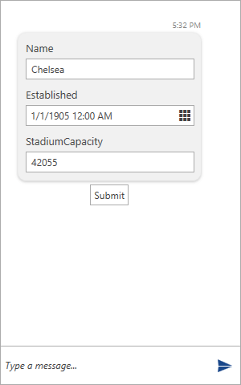

# DataForm Message

The __DataFormMessage__ mimics the [RadDataForm]() control for displaying its data. The constructor of this message and its parameters are illustrated below.

* __MessageDisplayPosition displayPosition__ 
* __Author author, object item__: the __item__ parameter has to be the reference of the item that is to be  edited.
* __IEnumerable<string> propertyNames__: the properties of the __item__ have to be passed as collection of strings.  
* __DateTime creationDate__: the __creationDate__ parameter is optional.

__Example 1: Defining a DataFormMessage__ 
```C#
	    Club chelsea = new Club()
            {
                Name = "Chelsea",
                StadiumCapacity = 42055,
                Established = new DateTime(1905, 1, 1)
            };

        List<string> listProperties = new List<string>();

        listProperties.Add("Name");
        listProperties.Add("StadiumCapacity");
        listProperties.Add("Established");

        DataFormMessage dataFormMessage 
				= new DataFormMessage(MessageDisplayPosition.Inline, this.currentAuthor, chelsea, listProperties);
 	    this.chat.AddMessage(dataFormMessage);
```

#### __Figure 1: Defining DataFormMessage__


## See Also

* [Messages Overview]()