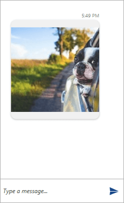
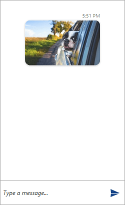

# Image  Message

The usage of the __ImageMessage__ is similar to the one of the [GifMessage](). The difference is that instead of passing a Uri source, the constructor accepts an Image source.

* __Author author__
* __ImageSource source__
* __DateTime creationDate__

__Example 1: Defining an ImageMessage__
```C#
	 ImageMessage imageMessage =
                new ImageMessage(this.currentAuthor, new BitmapImage(new Uri("/Images/dog.jpeg", UriKind.RelativeOrAbsolute)));

	this.chat.AddMessage(imageMessage);
```

#### __Figure 1: Defining ImageMessage__


Furthermore, the __ImageMessage__ supports setting __Stretch__ and __Size__ for its image.

__Example 2: Setting the Stretch and Size of the message__
```C#
	ImageMessage imageMessage =
                new ImageMessage(this.currentAuthor, new BitmapImage(new Uri("/Images/dog.jpeg", UriKind.RelativeOrAbsolute)));

            imageMessage.Stretch = Stretch.Fill;
            imageMessage.Size = new Size(150, 90);

	this.chat.AddMessage(imageMessage);
```

#### __Figure 2: Defining ImageMessage with Stretch and Size__


## See Also

* [Messages Overview]()