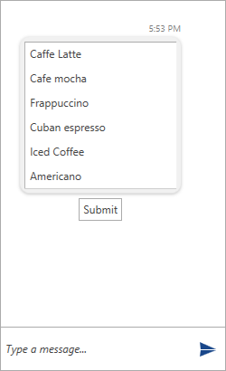

# List  Message

Specific for the __ListMessage__ is that it has to be populated with a source collection and can have its __SelectionMode__ set. The arguments of its constructor accept the following parameters.

* __MessageDisplayPosition displayPosition__
* __Author author__
* __IEnumerable source__
* __SelectionMode selectionMode__
* __DateTime creationDate__

__Example 1: Defining an ListMessage__
```C#
	   List<string> coffee = new List<string>();
            coffee.Add("Caffe Latte");
            coffee.Add("Cafe mocha");
            coffee.Add("Frappuccino");
            coffee.Add("Cuban espresso");
            coffee.Add("Iced Coffee");
            coffee.Add("Americano");

            ListMessage listMessageInline = new ListMessage(MessageDisplayPosition.Inline, this.currentAuthor, coffee, SelectionMode.Single);

            this.chat.AddMessage(listMessageInline);
```

#### __Figure 1: Defining ListMessage__


## See Also

* [Messages Overview]()