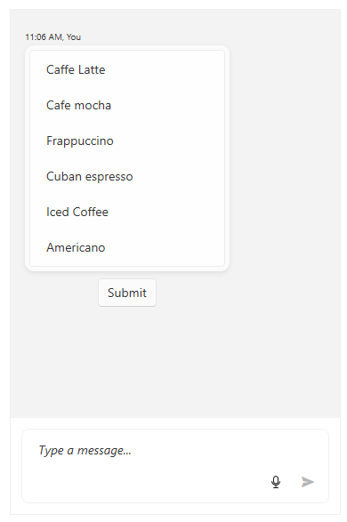

# List  Message

Specific for the __ListMessage__ is that it has to be populated with a source collection and can have its __SelectionMode__ set. The arguments of its constructor accept the following parameters.

* __MessageDisplayPosition displayPosition__
* __Author author__
* __IEnumerable source__
* __SelectionMode selectionMode__
* __DateTime creationDate__

__Example 1: Defining an ListMessage__
<snippet id='radchat-features-messages-listmessage-example_1_defining_an_listmessage-cs' />

#### __Figure 1: Defining ListMessage__

## See Also

* [Messages Overview]()