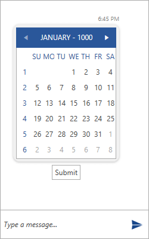
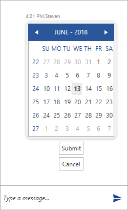
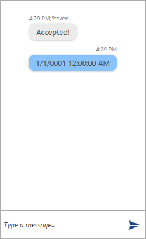

# Message Reports

## Default Response Actions

Interacting with the messages of __RadChat__ is done through __ResponseAction__ objects. There are two predefined ones for the __Commit__ and __Cancel__ operations. They should be added to the __ReportActions__ collection of the given message. Each __ReportAction__ can have its __Message__ and __Text__ properties set.

* __CommitResponseAction__
* __CancelResponseAction__

Their visual representation may vary depending on the type of message. For example, the default __CommitResponseAction__ that is defined for the __CalendarMessage__ would appear as a __Submit__ button shown below.

#### __Figure 1: Defining CalendarMessage__


__Example 1: Adding a CancelResponseAction__
```C#
	CalendarMessage calendarMessage = new CalendarMessage(MessageDisplayPosition.Inline, otherAuthor, DateTime.Now, DateTime.Now);
	calendarMessage.ReportActions.Add(new CancelResponseAction(calendarMessage, "Cancel"));
	this.chat.AddMessage(calendarMessage);
```

Adding a __CancelResponseAction__ will have the following output.

#### __Figure 2: Defining CalendarMessage with CancelResponseAction__


## Handling the Response

The user's interaction is handled through the __ReportMessageResult__ event. Its arguments expose the following properties. 

> The __ReportMessageResult__ is raised only for the built-in __ResponseActions__.

* __Message__: Provides information regarding the message that raises the current report.
* __TextMessageResult__: The result that will be posted as a text message can be controlled through it.
* __PropertyName__: Provides information of the property that has been edited. For example, for a __CalendarMessage__ it would be the __SelectedDate__ property.
* __DataObjectResult__: The data object value of the posted result.
* __PostResultInline__: A boolean property that indicates whether the text result should be posted as an inline message.
* __CloseAfterReport__: A boolean property that controls whether the message should be removed after the report.
* __MessageReportType__: Gets the message report type. It is of enum type and can either have a __Commit__ or __Cancel__ value.

As an example, lets have the following implementation of the event.
__Example 2: Handling the ReportMessageResult event__
```C#
	private void chat_ReportMessageResult(object sender, MessageResultEventArgs e)
	{
		if (e.Message is CalendarMessage)
		{
			if (e.ReportType == MessageReportType.Commit)
			{
				e.PostResultInline = true;
				e.CloseAfterReport = true;
				this.chat.AddMessage(this.otherAuthor, "Accepted!");
			}
			else if (e.ReportType == MessageReportType.Cancel)
			{
				e.CloseAfterReport = true;
				this.chat.AddMessage(this.otherAuthor, "Canceled!");
			}
		}
	}
```

So, if the user clicks the __Submit__ button for the previously defined __CalendarMessage__ the result will be as in the figure below.

#### __Figure 3: Handling the ReportMessageResult__


## Custom ResponseAction

A custom __ResponseAction__ provides the ability to trigger a custom __ICommand__ instead of handling the Response through the __ReportMessageResult__ event. This is done by inheriting the abstract __ResponseAction__ object.

## See Also

* [Messages Overview]()