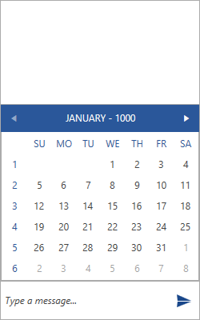
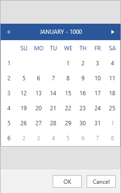

# Overview

__RadChat__ provides a predefined set of message types. They all have some common functionality which is derived from the __MessageBase__ class. All messages have an __Author__ and __CreationDate__. The message value is dependent on the given message type so it is not common for all messages. 

## Adding the Message

Adding a given message is done through the __AddMessage__ method of __RadChat__. It has the following two overloads.

* __(MessageBase message)__: pass the already defined type of message.
* __(Author author, string message)__: pass directly the string message and its __Author__. The control will internally wrap the string value into a __TextMessage__.

## Sending the Message

When sending a message the __SendMessage__ event will be triggered. Its arguments expose the __Message__ property through which the message that is currently being sent can be customized.

__Example 1: Handling the SendMessage event__ 
```C#
	private void Chat_SendMessage_(object sender, SendMessageEventArgs e)
        {
            var author = e.Message.Author;
            if (author == this.chat.CurrentAuthor)
            {
                this.chat.AddMessage(this.currentAuthor, (e.Message as TextMessage).Text);
                this.chat.AddMessage( this.otherAuthor, this.messageHelper.RecieveMessage(e.Message));

                e.Handled = true;
            }
        }
```

## Display Position

Depending on the type of the given message, it can have a different value for its __MessageDisplayPosition__ property. This is an enumeration that can have one of the following values.

* __Inline__
* __Popup__
* __Overlay__

For demonstrating the different __DisplayPositions__, a sample __CalendarMessage__ will be used. 

#### __Figure 1: Inline DisplayPosition__


#### __Figure 2: Popup DisplayPosition__


#### __Figure 3: Overlay DisplayPosition__


Note, that some message types support modifying their display position, whereas other ones have a fixed value which cannot be controlled. 

### Messages that can have their Display Position set

* [CalendarMessage]()
* [ListMessage]()
* [DataFormMessage]()
* [CarouselMessage]()

## Cards

__RadChat__ provides mechanism for displaying more complex information in a user-friendly structured manner and allowing the user to interact with it. This is done through the Card Messages. A built-in set of cards is defined to choose from depending on the data that is to be displayed. 

* [CardMessage]()
* [ImageCard]()
* [ProductCard]()
* [FlightCards]()
* [WeatherCards]()

## See Also 

* [Text Message]()

