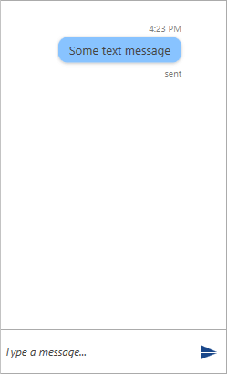

# Text Message

The __TextMessage__ is intended to be used for sending a simple string type message. Its constructor accepts the following parameters.

* __String text__ 
* __Author author__
* __String status__: when having a __status__ defined, the __creationDate__ needs to be set as well.
* __DateTime creationDate__: the __creationDate__ parameter can be set optionally.

__Example 1: Defining a TextMessage__ 
```C#
	var textMessage = new TextMessage(this.currentAuthor, "Some text message", "sent", DateTime.Now);
    textMessage.InlineViewModel.StatusVisibility = Visibility.Visible;

    this.chat.AddMessage(textMessage);
```

#### __Figure 1: Defining TextMessage__


## See Also

* [Messages Overview]()
