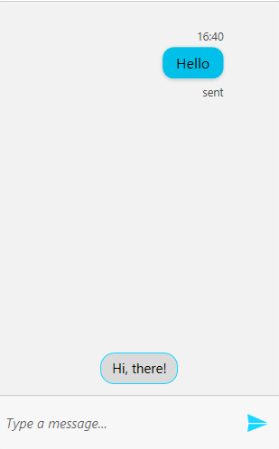
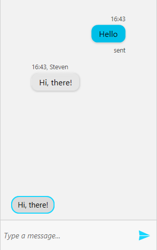
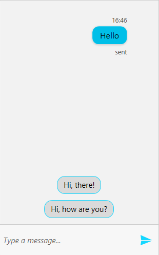

# Suggested Actions

__Conversational UI__ supports adding suggestions to the user. This can be done by adding __SuggestedAction__ items to the __SuggestedActions__ collection of __RadChat__.

## Adding the SuggestedAction

__Example 1__ demonstrates how to add a TextMessage and populate the __SuggestedActions__ collection of the RadChat. 

__Example 1: Adding SuggestedAction__ 
```C#

    private Author currentAuthor;
    private Author otherAuthor;

    public MainWindow()
    {
        InitializeComponent();

        currentAuthor = new Author("1") { Name = "Peter" };
        otherAuthor = new Author("2") { Name = "Steven" };
        this.chat.CurrentAuthor = currentAuthor;

        var textMessage = new TextMessage(this.currentAuthor, "Hello", "sent");
        textMessage.InlineViewModel.StatusVisibility = Visibility.Visible;

        this.chat.AddMessage(textMessage);

        this.chat.SuggestedActions.Add(new SuggestedAction("Hi, there!"));
    }
```

Adding the __SuggestedAction__ will be visualized as shown in __Figure 1__.

#### __Figure 1: Adding a SuggestedAction__


> By default the __SuggestedActions__ will be visible. In case they need to be hidden, the __SuggestedActionsVisibility__ of __RadChat__ can be set to __Collapsed__.

## Handling the SuggestedActionReported event

When the user selects a given suggestion, the __SuggestedActionReported__ is raised. Through it the user input can be modified. Its arguments expose the following members.

* __CloseAfterReport__: A boolean property that controls whether the message will be removed after it reports a result.
* __PostResultInline__: A boolean property that determines whether the suggestion should be posted as an inline text message or not.
* __Text__: The text result.

__Example 2: Handling the SuggestedActionReported event__ 
```C#

    private void Chat_SuggestedActionReported(object sender, SuggestedActionsEventArgs e)
    {
        if (e.Text == "Hi, there!")
        {
            e.CloseAfterReport = false;
            e.PostResultInline = false;

            this.chat.AddMessage(this.otherAuthor, e.Text);
        }
    }
```

#### __Figure 2: Handling the SuggestedActionReported event__


## SuggestedActionsOrientation

You have the option of setting the orientation in which the suggested actions are displayed. The default orientation is __Horizontal__.

__Example 3: Setting the SuggestedActionsOrientation__ 
```XAML

    <telerik:RadChat x:Name="chat" SuggestedActionsOrientation="Vertical"/>
```

#### __Figure 3: SuggestedActions with Vertical orientation__


## See Also

* [Overview]()

* [Getting Started]()

* [Messages Overview]()