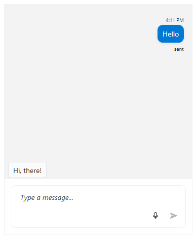
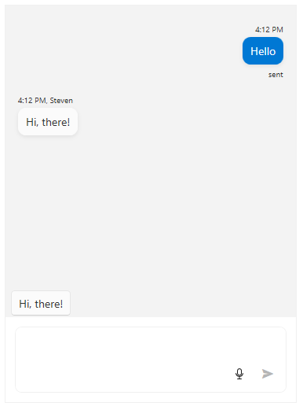
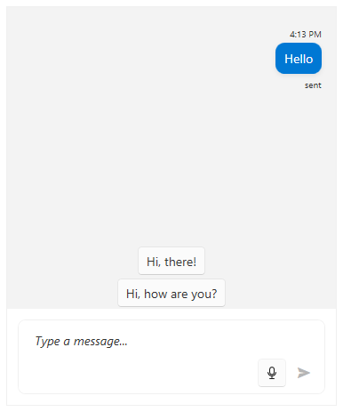

# Suggested Actions

__Conversational UI__ supports adding message suggestions in the chat's UI that can be used easily send text to the chat. 

## Adding the SuggestedAction

To add suggestions, use the `SuggestedActions` collection of `RadChat`. 

```C#
private Author currentAuthor;
private Author otherAuthor;

public MainWindow()
{
	InitializeComponent();

	currentAuthor = new Author("1") { Name = "Peter" };
	otherAuthor = new Author("2") { Name = "Steven" };
	this.chat.CurrentAuthor = currentAuthor;

	var textMessage = new TextMessage(this.currentAuthor, "Hello", "sent");
	textMessage.InlineViewModel.StatusVisibility = Visibility.Visible;

	this.chat.AddMessage(textMessage);

	this.chat.SuggestedActions.Add(new SuggestedAction("Hi, there!"));
}
```



The `SuggestedActions` are visible by default. In case they need to hide the suggestions, set the `SuggestedActionsVisibility` property of `RadChat` to `Collapsed`.

## Handling the SuggestedActionReported event

When the user selects a given suggestion, the `SuggestedActionReported` is raised. Through it the user input can be modified. Its arguments expose the following members.

* `CloseAfterReport`: A boolean property that controls whether the message will be removed after it reports a result.
* `PostResultInline`: A boolean property that determines whether the suggestion should be posted as an inline text message or not.
* `Text`: The text result.

```C#
private void Chat_SuggestedActionReported(object sender, SuggestedActionsEventArgs e)
{
	if (e.Text == "Hi, there!")
	{
		e.CloseAfterReport = false;
		e.PostResultInline = false;

		this.chat.AddMessage(this.otherAuthor, e.Text);
	}
}
```



## SuggestedActionsOrientation

To set the layout orientation of the suggested actions, use the `SuggestedActionsOrientation` property of `RadChat`.

```XAML
<telerik:RadChat x:Name="chat" SuggestedActionsOrientation="Vertical"/>
```



## See Also  
* [Overview]()
* [Getting Started]()
* [Messages Overview]()