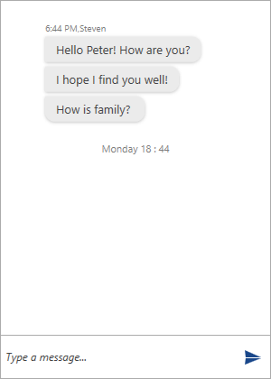

# Time Break

The __TimeBreak__ mechanism of __RadChat__ is intended to encapsulate a group of messages for a given time interval. It can be either added manually or automatically.

* [Adding a TimeBreak Automatically](#adding-a-timebreak-automatically)
* [Adding a TimeBreak Manually](#adding-a-timebreak-manually)
* [Handling the AddingTimeBreak](#handling-the-addingtimebreak)

## Adding a TimeBreak Automatically

__RadChat__ can automatically add a TimeBreak at a given interval. This can achieved by setting the __AutoIncludeTimeBreaks__ boolean property of __RadChat__ to __True__. Also, the needed __TimeSpan__ needs to be set to the __TimeBreakInterval__ property of the control.

## Adding a TimeBreak Manually
__RadChat__ provides the __AddTimeBreak__ method for adding a __TimeBreak__ which accepts a string parameter for its header.

__Example 2: Adding TimeBreak__ 
```C#
	 		var firstTextMessage = new TextMessage(this.otherAuthor, "Hello Peter! How are you?");
            var secondTextMessage = new TextMessage(this.otherAuthor, "I hope I find you well!");
            var thirdTextMessage = new TextMessage(this.otherAuthor, "How is family? ");

            this.chat.AddMessage(firstTextMessage);
            this.chat.AddMessage(secondTextMessage);
            this.chat.AddMessage(thirdTextMessage);

            this.chat.AddTimeBreak(DateTime.Now.DayOfWeek.ToString() + " " + DateTime.Now.TimeOfDay.Hours.ToString() + " : " + DateTime.Now.TimeOfDay.Minutes.ToString());
```

#### __Figure 2: Adding a TimeBreak__


## Handling the AddingTimeBreak Event

The __AddingTimeBreak__ event provides various information regarding the last __MessageGroup__ and the __Messages__ in it. Also, the event can be canceled. The following event arguments are exposed for this purpose.

* __Cancel__: The event can be canceled by setting the property to __True__.
* __Header__: Provides information regarding the current __Header__ that is to be set for the __TimeBreak__.
* __LastMessageGroup__

The __LastMessageGroup__ itself provides the following information.

* __Alignment__: Gets the alignment of the __MessageGroup__.
* __Author__: The group's __Author__.
* __AvatarAlignment__: Gets the alignment of the __Avatar__ according to the __CurrentAuthor__.
* __CreationDate__: Gets the time when the first __Message__ of the group was created.
* __Messages__: The collection of all messages within the group.

## See Also

* [Getting Started]() 
* [Typing Indicator]() 
* [Suggested Actions]()
