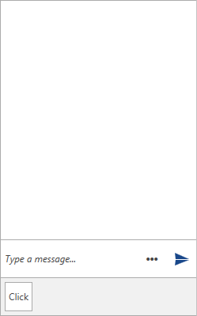
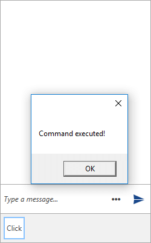
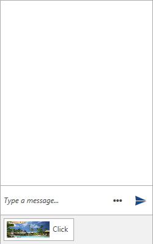

# ToolBar Commands

* [Adding a Command](#adding-a-command)
* [ToolBarCommandTemplateSelector](#toolbarcommandtemplateselector)

## Adding a Command

By default, the __ToolBar__ of __RadChat__ will not be visible. When a __ToolBarCommand__ is added to the __ToolBarCommands__ collection, the __ToggleButton__ for opening the __ToolBar__ will appear next to the __Send Button__. The __ToolBarCommand__ element exposes the following two properties.

* __Text__: The text Content that will be set to the generated __Button__.
* __Command__: The __ICommand__ that is to be executed when clicking the __Button__.

__Example 1: Defining a sample Command Action__ 
<snippet id='radchat-features-toolbar-commands-example_1_defining_a_sample_command_action-cs' />

__Example 2: Adding a ToolBarCommand__ 
<snippet id='radchat-features-toolbar-commands-example_2_adding_a_toolbarcommand-cs' />

Adding such __ToolBarCommand__ will have the following visual appearance.

#### __Figure 1: Opening the ToolBar__

Clicking the generated __Button__ will execute the defined __ICommand__.

#### __Figure 2: Executing the defined Command__

## ToolBarCommandTemplateSelector

The __Conversational UI__ supports defining custom __DataTemplate__ for the elements generated in its __ToolBar__. This is done through the __ToolBarCommandTemplateSelector__. Its conditional logic can be implemented based on the given __ToolBarCommand__.

__Example 3: Defining a ToolBarCommandTemplateSelector__
<snippet id='radchat-features-toolbar-commands-example_3_defining_a_toolbarcommandtemplateselector-cs' />

After having the __ToolBarCommandTemplateSelector__ implemented, it can be defined in XAML as follows.

__Example 4: Adding the ToolBarCommandTemplateSelector__
<snippet id='radchat-features-toolbar-commands-example_4_adding_the_toolbarcommandtemplateselector-xaml' />

Finally, the __ToolBarCommandTemplateSelector__ can be applied to __RadChat__.

__Example 5: Applying the ToolBarCommandTemplateSelector__
<snippet id='radchat-features-toolbar-commands-example_5_applying_the_toolbarcommandtemplateselector-xaml' />

#### __Figure 3: Conversational UI with custom ToolBarCommandTemplateSelector__

## See Also

* [Overview]()

* [Getting Started]()

* [Messages Overview]()