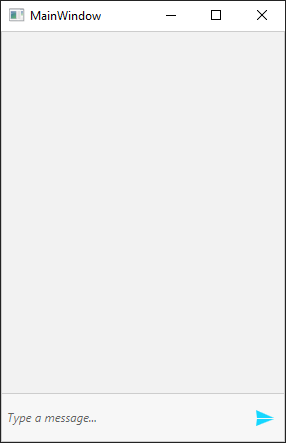
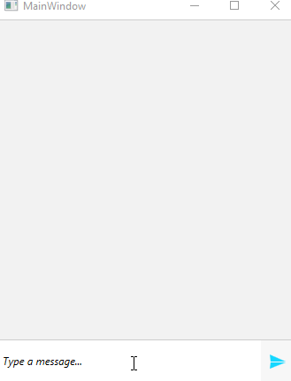
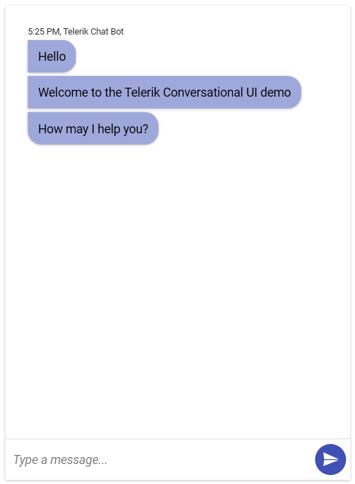

# Getting Started with {{ site.framework_name }} Chat

This topic will guide you through the process of creating a sample application containing __RadChat__.

## Adding Telerik Assemblies Using NuGet

To use __RadChat__ when working with NuGet packages, install the `Telerik.Windows.Controls.ConversationalUI.for.Wpf.Xaml` package. The [package name may vary]() slightly based on the Telerik dlls set - [Xaml or NoXaml]()

Read more about NuGet installation in the [Installing UI for WPF from NuGet Package]() article.

>tip With the 2025 Q1 release, the Telerik UI for WPF has a new licensing mechanism. You can learn more about it [here]().

## Adding Assembly References Manually

If you are not using NuGet packages, you can add a reference to the following assemblies:

* __Telerik.Licensing.Runtime__
* __Telerik.Windows.Controls__
* __Telerik.Windows.Controls.Input__
* __Telerik.Windows.Controls.Navigation__
* __Telerik.Windows.Controls.ConversationalUI__

## Adding RadChat to the Project

Before proceeding with adding __RadChat__ to your project, make sure the required assembly references are added to the project. 

You can add __Conversational UI__ manually by writing the XAML code in __Example 1__. You can also add the control by dragging it from the Visual Studio Toolbox and dropping it over the XAML view.

#### __[XAML] Example 1: Adding RadChat in XAML__

{{region xaml-chat-getting-started_0}}
	<telerik:RadChat x:Name="chat" />
{{endregion}}

Running the application at this state will result in an empty chat.

#### __Figure 1: The Empty Chat Generated by the Code in Example 1__

## Adding Authors to RadChat

Two authors will be defined for this example. Note, that the __CurrentAuthor__ property of __RadChat__  must be set.

#### __[C#] Example 3: Adding Authors to RadChat__

{{region cs-chat-getting-started_2}}
	public partial class MainWindow : Window
    {
        private Author currentAuthor;
        private Author otherAuthor;

        public MainWindow()
        {
            InitializeComponent();

            currentAuthor = new Author("Peter");
            otherAuthor = new Author("Steven");
            this.chat.CurrentAuthor = currentAuthor;
        }
    }
{{endregion}}

#### __[VB.NET] Example 3: Adding Authors to RadChat__

{{region vb-chat-getting-started_3}}
	Partial Public Class MainWindow
        Inherits Window

            Private currentAuthor As Author
            Private otherAuthor As Author

            Public Sub New()
                InitializeComponent()

                currentAuthor = New Author("Peter")
                otherAuthor = New Author("Steven")
                Me.chat.CurrentAuthor = currentAuthor
            End Sub
    End Class
{{endregion}}

## Handling the Sent Message

The user's input can be handled by hooking up to the __SendMessage__ event of __RadChat__. The event arguments are of type __RoutedEventArgs__ which are extended by the __Message__ property.

#### __[C#] Example 4: Subscribing to the SendMessage event__
{{region xaml-chat-getting-started_4}}
	<telerik:RadChat x:Name="chat" SendMessage="RadChat_SendMessage" />
{{endregion}}

#### __[C#] Example 5: SendMessage event handler__

{{region cs-chat-getting-started_5}}

    private void RadChat_SendMessage(object sender, SendMessageEventArgs e)
    {
        // We will handle the event in order to add a new message manually
        e.Handled = true;

        var updatedMessageText = "[Updated from event handler] " + (e.Message as TextMessage).Text;
        this.chat.AddMessage(this.chat.CurrentAuthor, updatedMessageText);
    }
{{endregion}}

#### __[VB.NET] Example 5: SendMessage event handler__

{{region vb-chat-getting-started_6}}

    Private Sub RadChat_SendMessage(ByVal sender As Object, ByVal e As SendMessageEventArgs)
		' We will handle the event in order to add a new message manually
		e.Handled = True

		Dim updatedMessageText = "[Updated from event handler] " & (TryCast(e.Message, TextMessage)).Text
		Me.chat.AddMessage(Me.chat.CurrentAuthor, updatedMessageText)
    End Sub
{{endregion}}

This setup will have the following result.

#### __Figure 2: RadChat with Messages__

## Setting a Theme

The controls from our suite support different themes. You can see how to apply a theme different than the default one in the [Setting a Theme]() help article.

>important Changing the theme using implicit styles will affect all controls that have styles defined in the merged resource dictionaries. This is applicable only for the controls in the scope in which the resources are merged. 

To change the theme, you can follow the steps below:

* Choose between the themes and add reference to the corresponding theme assembly (ex: **Telerik.Windows.Themes.Material.dll**). You can see the different themes applied in the **Theming** examples from our [WPF Controls Examples](https://demos.telerik.com/wpf/) application.

* Merge the ResourceDictionaries with the namespace required for the controls that you are using from the theme assembly. For the __RadChat__, you will need to merge the following resources:

	* __Telerik.Windows.Controls__
	* __Telerik.Windows.Controls.Input__
	* __Telerik.Windows.Controls.Navigation__
	* __Telerik.Windows.Controls.ConversationalUI__

__Example 6__ demonstrates how to merge the ResourceDictionaries so that they are applied globally for the entire application.

#### __[XAML] Example 6: Merge the ResourceDictionaries__  
{{region xaml-radchat-getting-started_7}}
	<Application.Resources>
		<ResourceDictionary>
			<ResourceDictionary.MergedDictionaries>
				<ResourceDictionary Source="/Telerik.Windows.Themes.Material;component/Themes/System.Windows.xaml"/>
				<ResourceDictionary Source="/Telerik.Windows.Themes.Material;component/Themes/Telerik.Windows.Controls.xaml"/>
				<ResourceDictionary Source="/Telerik.Windows.Themes.Material;component/Themes/Telerik.Windows.Controls.Input.xaml"/>
				<ResourceDictionary Source="/Telerik.Windows.Themes.Material;component/Themes/Telerik.Windows.Controls.Navigation.xaml"/>
				<ResourceDictionary Source="/Telerik.Windows.Themes.Material;component/Themes/Telerik.Windows.Controls.ConversationalUI.xaml"/>
			</ResourceDictionary.MergedDictionaries>
		</ResourceDictionary>
	</Application.Resources>
{{endregion}}

>Alternatively, you can use the theme of the control via the [StyleManager](https://docs.telerik.com/devtools/wpf/styling-and-appearance/stylemanager/common-styling-apperance-setting-theme-wpf)[StyleManager](https://docs.telerik.com/devtools/silverlight/styling-and-appearance/stylemanager/common-styling-apperance-setting-theme).

__Figure 3__ shows a __RadChat__ with the **Material** theme applied.
	
#### __Figure 3: RadChat with the Material theme__


## Telerik UI for WPF Learning Resources

* [Telerik UI for WPF ConversationalUI Component](https://www.telerik.com/products/wpf/conversational-ui.aspx)
* [Getting Started with Telerik UI for WPF Components]()
* [Telerik UI for WPF Installation]()
* [Telerik UI for WPF and WinForms Integration]()
* [Telerik UI for WPF Visual Studio Templates]()
* [Setting a Theme with Telerik UI for WPF]()
* [Telerik UI for WPF Virtual Classroom (Training Courses for Registered Users)](https://learn.telerik.com/learn/course/external/view/elearning/16/telerik-ui-for-wpf) 
* [Telerik UI for WPF License Agreement](https://www.telerik.com/purchase/license-agreement/wpf-dlw-s)


## See Also

* [Overview]()
* [Messages Overview]()