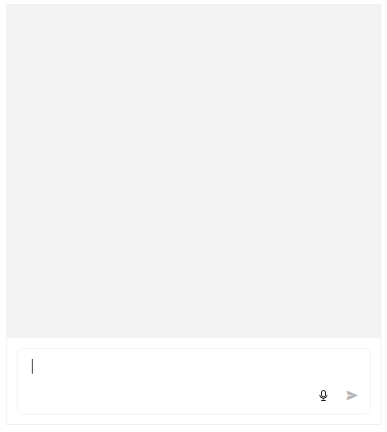
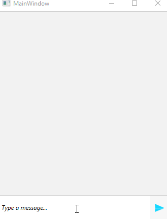

# Getting Started with {{ site.framework_name }} Chat

This topic will guide you through the process of creating a sample application containing __RadChat__.

## Adding Telerik Assemblies Using NuGet

To use __RadChat__ when working with NuGet packages, install the `Telerik.Windows.Controls.ConversationalUI.for.Wpf.Xaml` package. The [package name may vary]() slightly based on the Telerik dlls set - [Xaml or NoXaml]()

Read more about NuGet installation in the [Installing UI for WPF from NuGet Package]() article.

>tip With the 2025 Q1 release, the Telerik UI for WPF has a new licensing mechanism. You can learn more about it [here]().

## Adding Assembly References Manually

If you are not using NuGet packages, you can add a reference to the following assemblies:

* __Telerik.Licensing.Runtime__
* __Telerik.Windows.Controls__
* __Telerik.Windows.Controls.Input__
* __Telerik.Windows.Controls.Navigation__
* __Telerik.Windows.Controls.ConversationalUI__
* __Telerik.Windows.Controls.GridView__
* __Telerik.Windows.Controls.FileDialogs__
* __Telerik.Windows.Controls.Data__

## Adding RadChat to the Project

Before proceeding with adding __RadChat__ to your project, make sure the required assembly references are added to the project. 

You can add __Conversational UI__ manually by writing the XAML code in __Example 1__. You can also add the control by dragging it from the Visual Studio Toolbox and dropping it over the XAML view.

__Example 1: Adding RadChat in XAML__

```XAML
<telerik:RadChat x:Name="chat" />
```

Running the application at this state will result in an empty chat.

__Empty chat example__



## Adding Authors to RadChat

Two authors will be defined for this example. Note, that the __CurrentAuthor__ property of __RadChat__  must be set.

__Adding Authors to RadChat__

```C#
public partial class MainWindow : Window
{
	private Author currentAuthor;
	private Author otherAuthor;

	public MainWindow()
	{
		InitializeComponent();

		currentAuthor = new Author("Peter");
		otherAuthor = new Author("Steven");
		this.chat.CurrentAuthor = currentAuthor;
	}
}
```

## Handling the Sent Message

The user's input can be handled by hooking up to the __SendMessage__ event of __RadChat__. The event arguments are of type __RoutedEventArgs__ which are extended by the __Message__ property.

__Subscribing to the SendMessage event__
```C#
<telerik:RadChat x:Name="chat" SendMessage="RadChat_SendMessage" />
```

__SendMessage event handler__

```C#
private void RadChat_SendMessage(object sender, SendMessageEventArgs e)
{
	// We will handle the event in order to add a new message manually
	e.Handled = true;

	var updatedMessageText = "[Updated from event handler] " + (e.Message as TextMessage).Text;
	this.chat.AddMessage(this.chat.CurrentAuthor, updatedMessageText);
}
```

This setup will have the following result.

__RadChat with Messages__




## Telerik UI for WPF Learning Resources

* [Telerik UI for WPF ConversationalUI Component](https://www.telerik.com/products/wpf/conversational-ui.aspx)
* [Getting Started with Telerik UI for WPF Components]()
* [Telerik UI for WPF Installation]()
* [Telerik UI for WPF and WinForms Integration]()
* [Telerik UI for WPF Visual Studio Templates]()
* [Setting a Theme with Telerik UI for WPF]()
* [Telerik UI for WPF Virtual Classroom (Training Courses for Registered Users)](https://learn.telerik.com/learn/course/external/view/elearning/16/telerik-ui-for-wpf) 
* [Telerik UI for WPF License Agreement](https://www.telerik.com/purchase/license-agreement/wpf-dlw-s)


## See Also

* [Overview]()
* [Messages Overview]()