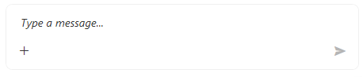
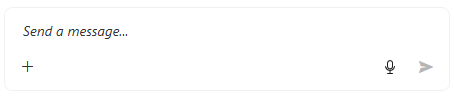
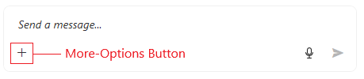
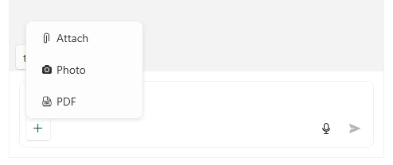
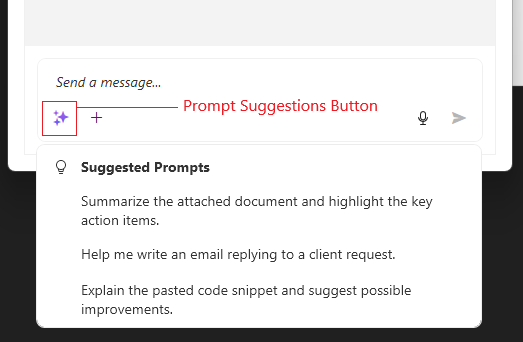

# Input Box Settings

The input box is represented by the `RadPromptInput` contorl which allows you to write text, speak and to attach files.



## Setting Text Programmatically

To set the text of the input box, use the `InputBoxText` property of `RadChat`.

```XAML
<telerik:RadChat InputBoxText="Hello there!" />
```

## Speech to Text Button

By default the input box displays a `RadSpeechToTextButton` which allows the user to speak instead of typing. To __hide the button__ set the `IsSpeechToTextButtonVisible` property of `RadChat` to `False`.

```XAML
<telerik:RadChat IsSpeechToTextButtonVisible="False" />
```

## Setting Watermark Text

The empty text placeholder can be set via the `InputBoxWatermarkContent` property of `RadChat`.



## More-Options Button

The more options drop-down button is located under the text area of the input box and by default it displays options for [attaching files and photos]().

The button is hidden but default. To __show it__, set the `IsMoreButtonVisible` property of `RadChat` to `True`.

```XAML
<telerik:RadChat IsMoreButtonVisible="True" />
```



To __add more options__ in the drop down, use the `MoreButtonActions` collection of the input box visual (`RadPromptInput`).

```C#
 private void RadChat_Loaded(object sender, RoutedEventArgs e)
 {
     var chat = (RadChat)sender;
     var promptInput = chat.FindChildByType<RadPromptInput>();
     promptInput.MoreButtonActions.Add(new PromptInputButtonAction() { Text = "PDF", Icon = "&#xe90e;", Command = myAttachPdfCommand });
 }
```



## Suggested Prompts List

The input box allows you to define and display a list of suggested prompt which can be used when implementing AI-based chat applications.

To show the button that opens the suggested prompts, set the `IsPromptSuggestionsButtonVisible` property of the input box visual (`RadPromptInput`) to `true`.

To add suggestions, use the `SuggestedPrompts` collection of the input box visual (`RadPromptInput`).

```C#
private void RadChat_Loaded(object sender, RoutedEventArgs e)
{
    var chat = (RadChat)sender;
    var promptInput = chat.FindChildByType<RadPromptInput>();
	promptInput.IsPromptSuggestionsButtonVisible = true;
    promptInput.SuggestedPrompts.Add("Summarize the attached document and highlight the key action items.");
    promptInput.SuggestedPrompts.Add("Help me write an email replying to a client request.");
    promptInput.SuggestedPrompts.Add("Explain the pasted code snippet and suggest possible improvements.");
}
```




