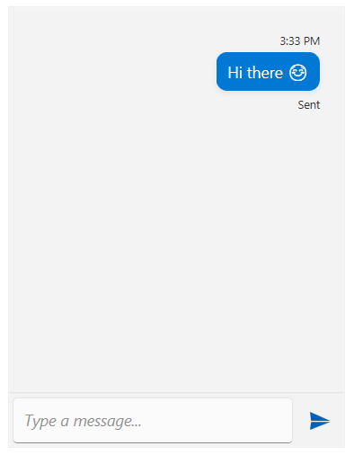

# Message Status

The RadChat [messages]() allows you to display a custom status message text under the message (eg. "Sent", "Delivered", "Seen", etc.).

The status message visual is enabled by setting the `StatusVisibility` property of the view model of the message object.

The status text is set via the `Status` property of the message's view model.

__Creating a new message and setting the message status__

```C#
var message = new TextMessage(this.radChat.CurrentAuthor, "Hi there ☺");
message.InlineViewModel.StatusVisibility = Visibility.Visible;
message.InlineViewModel.Status = "Sent";
this.radChat.AddMessage(message);
```



You can later access the message and update its status if necessary.

__Updating the message status__

```C#
var message = this.radChat.GetMessageByIndex(0) as TextMessage;
message.InlineViewModel.Status = "Delivered";
```