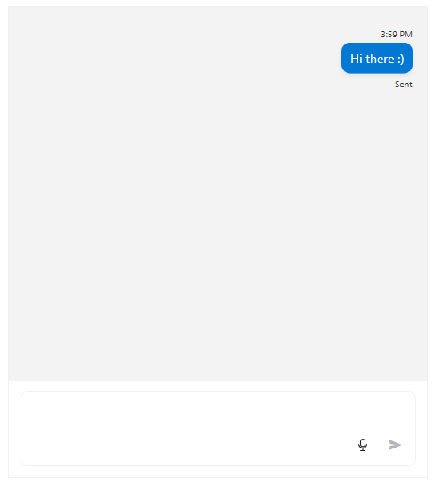

# Message Status

The RadChat [messages]() allows you to display a custom status message text under the message (eg. "Sent", "Delivered", "Seen", etc.).

The status message visual is enabled by setting the `StatusVisibility` property of the view model of the message object.

The status text is set via the `Status` property of the message's view model.

__Creating a new message and setting the message status__

<snippet id='radchat-message-status-creating_a_new_message_and_setting_the_message_status-cs' />

You can later access the message and update its status if necessary.

__Updating the message status__

<snippet id='radchat-message-status-updating_the_message_status-cs' />