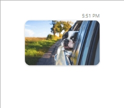

# Image  Message

The usage of the __ImageMessage__ is similar to the one of the [GifMessage](). The difference is that instead of passing a Uri source, the constructor accepts an Image source.

* __Author author__
* __ImageSource source__
* __DateTime creationDate__

__Defining an ImageMessage__
<snippet id='radchat-features-messages-imagemessage-example_1_defining_an_imagemessage-cs' />

__Defining ImageMessage__

Furthermore, the __ImageMessage__ supports setting __Stretch__ and __Size__ for its image.

__Setting the Stretch and Size of the Message__
<snippet id='radchat-features-messages-imagemessage-example_2_setting_the_stretch_and_size_of_the_message-cs' />

__Defining ImageMessage with Stretch and Size__

## See Also

* [Messages Overview]()