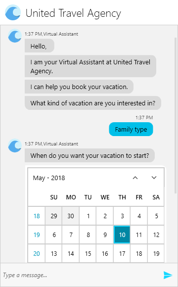

# Overview

The __RadChat__ component is exposed as of __R2 2018__. It enables easy implementation of conversational UI in WPF applications, whether by utilizing certain chatbot framework, by following a predefined logical tree, or just for integrating P2P chat capabilites. 

#### __Figure 1: RadChat__

__Conversational UI's__ features list:

* __Messages__: A predefined set of built-in messages depending on the type of data that needs to be sent.

* __Cards__: Displaying a message in a structured and intuitive for the user manner.

* __Overlays__: Calendar, List, Carousel, etc. 

* __Suggested Actions__: Make the user's input easier by adding suggestions.

* __Type Indicator__: Indicate to the current user that another __Author__ is typing.

* __ToolBar Commands__: Enabling user interaction with the __ToolBar__ through triggering __ToolBarCommands__.

* __Predefined variety of themes__

* __Customizable layout__

## See Also

* [Getting Started]()
* [Messages Overview]()
* [ToolBar Commands]()
* [Suggested Actions]()

 

