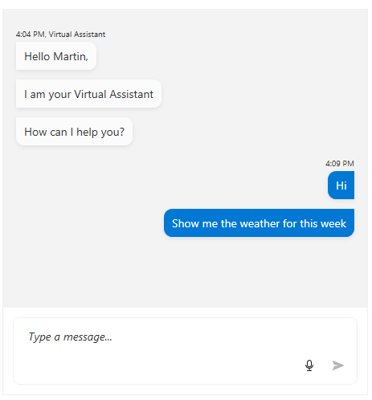

# Data Binding to Collection

This article shows how to use RadChat in MVVM scenario by data binding its items source to a collection of view models.

To data bind the messages list you can use the __DataSource__ and __MessageConverter__ properties of the RadChat control.

The __DataSource__ property expects a collection of business objects containing information about the messages. 

The __MessageConverter__ allows you to use an implementation of the [IMessageConverter](https://docs.telerik.com/devtools/wpf/api/telerik.windows.controls.conversationalui.imessageconverter) interface. This is used to convert between the business object models and the RadChat [message models](). The __ConvertItem__ method should convert a business object to a message object and __ConvertMessage__ should convert a message object to a business object.

The following example shows how to define custom models and use the converter.

__Example 1: Defining the messages view model__
<snippet id='radchat-populating-with-data-data-binding-to-collection-example_1_defining_the_messages_view_model-cs' />

__Example 2: Defining the main view model and populating the data source with data__
<snippet id='radchat-populating-with-data-data-binding-to-collection-example_2_defining_the_main_view_model_and_populating_the_data_source_with_data-cs' />

__Example 3: Implementing message converter__
<snippet id='radchat-populating-with-data-data-binding-to-collection-example_3_implementing_message_converter-cs' />

__Example 4: Setting up the RadChat control__
<snippet id='radchat-populating-with-data-data-binding-to-collection-example_4_setting_up_the_radchat_control-xaml' />

> The example demonstrates how to work with text messages, but the same approach is also applicable for the other message types. 

## See Also  
* [Getting Started]()
