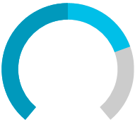

# {{ site.framework_name }} RadCircularProgressBar Angles

`RadCircularProgressBar` allows you to specify the degrees of the start and end angles of the progress track and progress indicator. To do so, set the `StartAngle` and `EndAngle` properties. The default values of these properties are __0__ and __360__.

#### __[XAML] Setting start and end angles__
{{region radcircularprogressbar-angles-0}}
    <telerik:RadCircularProgressBar Name="circularProgressBar" Value="0.5" SecondaryValue="0.75" StartAngle="220" EndAngle="500"/>
{{endregion}}

#### __[C#] Setting start and end angles in code__
{{region radcircularprogressbar-angles-1}}
    RadCircularProgressBar radCircularProgressBar = new RadCircularProgressBar();
    radCircularProgressBar.Value = 0.5;
    radCircularProgressBar.SecondaryValue = 0.75;
    radCircularProgressBar.StartAngle = 220;
    radCircularProgressBar.EndAngle = 500;
{{endregion}}

#### __[VB.NET] Setting start and end angles in code__
{{region radcircularprogressbar-angles-2}}
    Dim radCircularProgressBar As RadCircularProgressBar = New RadCircularProgressBar()
    radCircularProgressBar.Value = 0.5
    radCircularProgressBar.SecondaryValue = 0.75
    radCircularProgressBar.StartAngle = 220
    radCircularProgressBar.EndAngle = 500
{{endregion}}

## See Also
* [Color Ranges]()
* [Secondary Progress Indicator]()
* [Radiuses]()