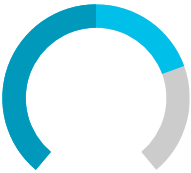

# Angles

`RadCircularProgressBar` allows you to specify the degrees of the start and end angles of the progress track and progress indicator. To do so, set the `StartAngle` and `EndAngle` properties. The default values of these properties are __0__ and __360__.

__Setting start and end angles__
<snippet id='radcircularprogressbar-angles-setting_start_and_end_angles-xaml' />

__Setting start and end angles in code__
<snippet id='radcircularprogressbar-angles-setting_start_and_end_angles_in_code-cs' />

<snippet id='radcircularprogressbar-angles-setting_start_and_end_angles_in_code-vb' />

## See Also
* [Color Ranges]()
* [Secondary Progress Indicator]()
* [Radiuses]()