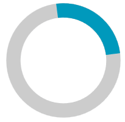

# Indeterminate State Animation Customization

The indeterminate state animation of `RadCircularProgressBar` is represented by the `AnimationManager` class. To customize the default animation, create a new `RadDoubleAnimation` object instance for the `AnimationManager.AnimationSelector` attached property. To apply the custom animation correctly, set the `AnimationName` property's value to __IndeterminateIndicatorAnimation__.

>important The `TargetElementName` property has to be set to __PART\_IndicatorPath__. `PropertyName` property has to be equal to __(UIElement.RenderTransform).(TransformGroup.Children)[2].(RotateTransform.Angle)__.

__Setting a custom RadDoubleAnimation__
```XAML
    <telerik:RadCircularProgressBar Name="circularProgressBar" 
                                    IsIndeterminate="True"
                                    IndeterminateIndicatorRatio="0.25">
        <telerik:AnimationManager.AnimationSelector>
            <telerik:AnimationSelector>
                <telerik:RadDoubleAnimation AnimationName="IndeterminateIndicatorAnimation"
                                            Direction="Out" 
                                            RepeatBehavior="Forever" 
                                            Duration="00:00:01" 
                                            StartValue="0"
                                            TargetValue="360"
                                            SpeedRatio="0.3"
                                            TargetElementName="PART_IndicatorPath"
                                            PropertyName="(UIElement.RenderTransform).(TransformGroup.Children)[2].(RotateTransform.Angle)">
                </telerik:RadDoubleAnimation>
            </telerik:AnimationSelector>
        </telerik:AnimationManager.AnimationSelector>
    </telerik:RadCircularProgressBar>
```



## Animation Easing

The `RadDoubleAnimation` class supports applying animation easing. To do so, set any object that implements the `IEasingFunction` interface to its `Easing` property.

The following code snippet shows the above example with a custom `BounceEase` instance:

__Applying a BounceEase animation easing__
```XAML
    <telerik:RadCircularProgressBar Name="circularProgressBar" 
                                    IsIndeterminate="True"
                                    IndeterminateIndicatorRatio="0.25">
        <telerik:AnimationManager.AnimationSelector>
            <telerik:AnimationSelector>
                <telerik:RadDoubleAnimation AnimationName="IndeterminateIndicatorAnimation"
                                            Direction="Out" 
                                            RepeatBehavior="Forever" 
                                            Duration="00:00:01" 
                                            StartValue="0"
                                            TargetValue="360"
                                            SpeedRatio="0.3"
                                            TargetElementName="PART_IndicatorPath"
                                            PropertyName="(UIElement.RenderTransform).(TransformGroup.Children)[2].(RotateTransform.Angle)">
                    <telerik:RadDoubleAnimation.Easing>
                        <BounceEase Bounces="25" Bounciness="5" EasingMode="EaseOut"/>
                    </telerik:RadDoubleAnimation.Easing>
                </telerik:RadDoubleAnimation>
            </telerik:AnimationSelector>
        </telerik:AnimationManager.AnimationSelector>
    </telerik:RadCircularProgressBar>
```


## See Also
* [Custom Content]()