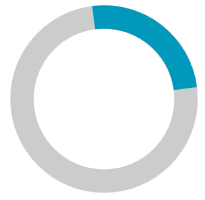

# Indeterminate State Animation Customization

The indeterminate state animation of `RadCircularProgressBar` is represented by the `AnimationManager` class. To customize the default animation, create a new `RadDoubleAnimation` object instance for the `AnimationManager.AnimationSelector` attached property. To apply the custom animation correctly, set the `AnimationName` property's value to __IndeterminateIndicatorAnimation__.

>important The `TargetElementName` property has to be set to __PART\_IndicatorPath__. `PropertyName` property has to be equal to __(UIElement.RenderTransform).(TransformGroup.Children)[2].(RotateTransform.Angle)__.

__Setting a custom RadDoubleAnimation__
<snippet id='radcircularprogressbar-animation-customization-setting_a_custom_raddoubleanimation-xaml' />

## Animation Easing

The `RadDoubleAnimation` class supports applying animation easing. To do so, set any object that implements the `IEasingFunction` interface to its `Easing` property.

The following code snippet shows the above example with a custom `BounceEase` instance:

__Applying a BounceEase animation easing__
<snippet id='radcircularprogressbar-animation-customization-applying_a_bounceease_animation_easing-xaml' />

## See Also
* [Custom Content]()