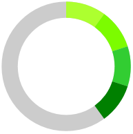
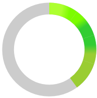

# Color Ranges

`RadCircularProgressBar` supports setting different color ranges for the progress indicator. This is done by adding `ProgressBarColorRange` instances to the control's `ColorRanges` collection. To specify the start and end ranges of ProgressBarColorRange, set the `Start` and `End` properties. These properties are of type `double`. To specify the color for the color range, set its `Color` property.

>important The secondary indicator and segments are not supported when having color ranges.

__RadCircularProgressBar with multiple color ranges__
```XAML
    <telerik:RadCircularProgressBar Value="0.4">
        <telerik:RadCircularProgressBar.ColorRanges>
            <telerik:ProgressBarColorRange Color="GreenYellow" Start="0" End="0.1"/>
            <telerik:ProgressBarColorRange Color="LawnGreen" Start="0.1" End="0.2"/>
            <telerik:ProgressBarColorRange Color="LimeGreen" Start="0.2" End="0.3"/>
            <telerik:ProgressBarColorRange Color="Green" Start="0.3" End="0.4"/>
        </telerik:RadCircularProgressBar.ColorRanges>
    </telerik:RadCircularProgressBar>
```



## Gradient Colors

`ProgressBarColorRange` class allows you to set its fill to be a gradient. To do so, set the `IsGradient` property to __True__.

The following sample extends the implementation of the above example:

__Setting the IsGradient property__
```XAML
    <telerik:RadCircularProgressBar.ColorRanges>
        <telerik:ProgressBarColorRange Color="GreenYellow" Start="0" End="0.1" IsGradient="True"/>
        <telerik:ProgressBarColorRange Color="LawnGreen" Start="0.1" End="0.2" IsGradient="True"/>
        <telerik:ProgressBarColorRange Color="LimeGreen" Start="0.2" End="0.3" IsGradient="True"/>
        <telerik:ProgressBarColorRange Color="Green" Start="0.3" End="0.4" IsGradient="True"/>
    </telerik:RadCircularProgressBar.ColorRanges>
```

__RadCircularProgressBar with gradient color ranges__



## See Also
* [Segments]()