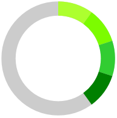
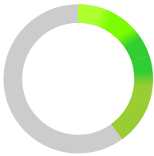

# Color Ranges

`RadCircularProgressBar` supports setting different color ranges for the progress indicator. This is done by adding `ProgressBarColorRange` instances to the control's `ColorRanges` collection. To specify the start and end ranges of ProgressBarColorRange, set the `Start` and `End` properties. These properties are of type `double`. To specify the color for the color range, set its `Color` property.

>important The secondary indicator and segments are not supported when having color ranges.

__RadCircularProgressBar with multiple color ranges__
<snippet id='radcircularprogressbar-color-ranges-radcircularprogressbar_with_multiple_color_ranges-xaml' />

## Gradient Colors

`ProgressBarColorRange` class allows you to set its fill to be a gradient. To do so, set the `IsGradient` property to __True__.

The following sample extends the implementation of the above example:

__Setting the IsGradient property__
<snippet id='radcircularprogressbar-color-ranges-setting_the_isgradient_property-xaml' />

__RadCircularProgressBar with gradient color ranges__

## See Also
* [Segments]()