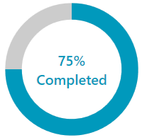
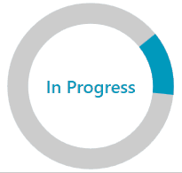
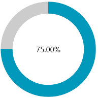

# Custom Content

`RadCircularProgressBar` supports setting a complex structure of elements to the `ContentTemplate` property to represent the value set for the `Content` property. The Content property is of type `object` and can hold a value of any type.

__Setting the Content and ContentTemplate properties__
```XAML
    <telerik:RadCircularProgressBar Name="circularProgressBar" 
                                    Value="75"
                                    Maximum="100"
                                    Content="{Binding ElementName=circularProgressBar, Path=Value}">
        <telerik:RadCircularProgressBar.ContentTemplate>
            <DataTemplate>
                <StackPanel Orientation="Vertical">
                    <TextBlock Text="{Binding Path=., StringFormat={}{0}%}"
                       TextAlignment="Center"
                       FontSize="16"
                       FontWeight="SemiBold" 
                       Foreground="{Binding ElementName=circularProgressBar, Path=IndicatorFill}"/>
                    <TextBlock Text="Completed" 
                       FontSize="16"
                       FontWeight="SemiBold" 
                       Foreground="{Binding ElementName=circularProgressBar, Path=IndicatorFill}"/>
                </StackPanel>
            </DataTemplate>
        </telerik:RadCircularProgressBar.ContentTemplate>
    </telerik:RadCircularProgressBar>
```



__Custom content with indeterminate state__
```XAML
    <telerik:RadCircularProgressBar Name="circularProgressBar" 
                                    Value="75"
                                    Maximum="100"
                                    IsIndeterminate="True"
                                    Content="In Progress">
        <telerik:RadCircularProgressBar.ContentTemplate>
            <DataTemplate>
                <TextBlock Text="{Binding}"
                           FontSize="16" 
                           FontWeight="SemiBold"
                           Foreground="{Binding ElementName=circularProgressBar, Path=IndicatorFill}"/>
            </DataTemplate>
        </telerik:RadCircularProgressBar.ContentTemplate>
    </telerik:RadCircularProgressBar>
```



## ContentStringFormat

RadCircularProgressBar allows you to set a string format to the `ContentStringFormat` property. This format will be applied to the Content property.

__Custom ContentStringFormat__
```XAML
    <telerik:RadCircularProgressBar Name="circularProgressBar" 
                                    Value="0.75"
                                    Content="{Binding ElementName=circularProgressBar, Path=Value}" 
                                    ContentStringFormat="p2"/>
```



>tip Check this [article](https://docs.microsoft.com/en-us/dotnet/standard/base-types/standard-numeric-format-strings) for more information on the supported formats.

## See Also
* [Indeterminate State Animation Customization]()