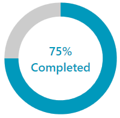
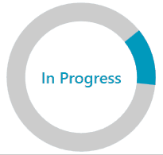
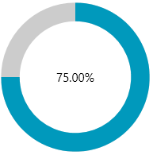

# Custom Content

`RadCircularProgressBar` supports setting a complex structure of elements to the `ContentTemplate` property to represent the value set for the `Content` property. The Content property is of type `object` and can hold a value of any type.

__Setting the Content and ContentTemplate properties__
<snippet id='radcircularprogressbar-custom-content-setting_the_content_and_contenttemplate_properties-xaml' />

__Custom content with indeterminate state__
<snippet id='radcircularprogressbar-custom-content-custom_content_with_indeterminate_state-xaml' />

## ContentStringFormat

RadCircularProgressBar allows you to set a string format to the `ContentStringFormat` property. This format will be applied to the Content property.

__Custom ContentStringFormat__
<snippet id='radcircularprogressbar-custom-content-custom_contentstringformat-xaml' />

>tip Check this [article](https://docs.microsoft.com/en-us/dotnet/standard/base-types/standard-numeric-format-strings) for more information on the supported formats.

## See Also
* [Indeterminate State Animation Customization]()