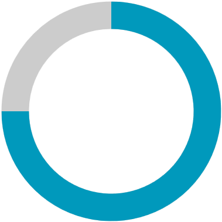
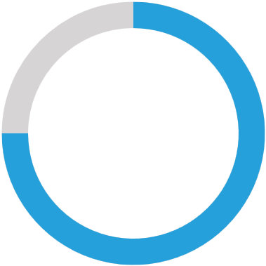

# Getting Started

This tutorial will walk you through the creation of a sample application that contains a `RadCircularProgressBar` control.

## Assembly References

To use RadCircularProgressBar, add a reference to the following assembly:

* __Telerik.Windows.Controls__

## Defining the RadCircularProgressBar

To control the progress of RadCircularProgressBar, utilize its `Value` property. To control the minimum and maximum value of the progress, set the `Minimum` and `Maximum` properties.

>important If the Minimum and Maximum properties are not set, their default values will be used. The Minimum property's default value is __0__. The Maximum property has a value of __1__.

RadCircularProgressBar can be instantiated both in XAML and in code.

#### __[XAML] Defining RadCircularProgressBar in XAML__
{{region radcircularprogressbar-getting-started-0}}
    <telerik:RadCircularProgressBar Name="radCircularProgressBar" Value="0.75" />    
{{endregion}}

#### __[C#] Defining RadCircularProgressBar in code__
{{region radcircularprogressbar-getting-started-1}}
    RadCircularProgressBar radCircularProgressBar = new RadCircularProgressBar();
    radCircularProgressBar.Value = 0.75;
{{endregion}}

#### __[VB.NET] Defining RadCircularProgressBar in code__
{{region radcircularprogressbar-getting-started-2}}
    Dim radCircularProgressBar As RadCircularProgressBar = New RadCircularProgressBar()
    radCircularProgressBar.Value = 0.75
{{endregion}}

## Setting a Theme

The controls from our suite support different themes. You can see how to apply a theme different than the default one in the [Setting a Theme]() help article.

>important Changing the theme using implicit styles will affect all controls that have styles defined in the merged resource dictionaries. This is applicable only for the controls in the scope in which the resources are merged. 

* Choose between the themes and add reference to the corresponding theme assembly (ex: __Telerik.Windows.Themes.Windows8.dll__). You can see the different themes applied in the __Theming__ examples from our [WPF Controls Examples](https://demos.telerik.com/wpf/)[Silverlight Controls Examples](https://demos.telerik.com/silverlight/#PanelBar/Theming) application.

* Merge the ResourceDictionaries with the namespace required for the controls that you are using from the theme assembly. For the RadCircularProgressBar, you will need to merge the following resources:

	* __Telerik.Windows.Controls__

The following example demonstrates how to merge the ResourceDictionaries so that they are applied globally for the entire application.

#### __[XAML] Merge the ResourceDictionaries__
{{region radcircularprogressbar-getting-started-3}}
    <Application.Resources>
    	<ResourceDictionary>
    		<ResourceDictionary.MergedDictionaries>
    			<ResourceDictionary Source="/Telerik.Windows.Themes.Windows8;component/ Themes/System.Windows.xaml"/>
    			<ResourceDictionary Source="/Telerik.Windows.Themes.Windows8;component/ Themes/Telerik.Windows.Controls.xaml"/>
    		</ResourceDictionary.MergedDictionaries>
    	</ResourceDictionary>
    </Application.Resources>
{{endregion}}

>Alternatively, you can use the theme of the control via the [StyleManager](https://docs.telerik.com/devtools/wpf/styling-and-appearance/stylemanager/common-styling-apperance-setting-theme-wpf)[StyleManager](https://docs.telerik.com/devtools/silverlight/styling-and-appearance/stylemanager/common-styling-apperance-setting-theme).

The following image shows a RadCircularProgressBar with the __Windows8__ theme applied.

__RadCircularProgressBar with the Windows8 theme__

## See Also
* [Visual Structure](%slug radcircularprogressbar-visual-structure%)
* [States]()
* [Segments]()
* [Color Ranges]()