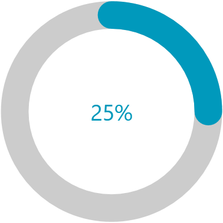

# Overview

CircularProgressBar is a component that allows you to convey the progress of different tasks in a circular manner. 





>tip Get started with the control with its [Getting Started]() help article that shows how to use it in a basic scenario.

## Key Features

* __Segments__&mdash;The CircularProgressBar can be split into numerous segments to indicate its progress.

* __Color Ranges__&mdash;CircularProgressBar supports definding ranges with different colors. Each range allows you to specify a start and end position, as well as an option to make its fill gradient.

* __Determinate and indeterminate states__&mdash;The determinate state shows a specific amount of the progress. The indeterminate one plays an animation of the circular progress.

* __Customizable content__&mdash;CircularProgressBar supports complex implementation for the content of its progress.

* __Radius manipulation__&mdash;The control allows you to customize the indicator and track inner and outer radiuses.

* __Angles__&mdash;You can control the beginning and ending angles of the component for a more customized appearance.

* __Secondary progress indicator__&mdash;CircularProgressBar allows you to visualize an additional progress indicator. This is useful in scenarios where the primary indicator depends on the progress of the secondary one.

* __Indeterminate animation customization__&mdash;You can modify the played animation when CircularProgressBar is in indeterminate state.

> Check out the demos application at [demos.telerik.com](https://demos.telerik.com/wpf/).

## See Also
* [Getting Started]()