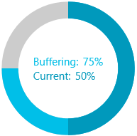
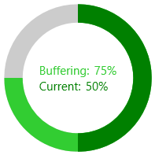

# Secondary Progress Indicator

`RadCircularProgressBar` allows you to visualize a second progress indicator. This is intended for scenarios where the primary indicator depends on the process of the secondary one. To display the second progress indicator, set the `SecondaryValue` property.

__Setting the SecondaryValue property__
```XAML
    <telerik:RadCircularProgressBar Name="radCircularProgressBar"
                                    Minimum="0"
                                    Maximum="100" 
                                    Value="50"
                                    SecondaryValue="75">
        <telerik:RadCircularProgressBar.Content>
            <Grid>
                <Grid.RowDefinitions>
                    <RowDefinition Height="Auto"/>
                    <RowDefinition Height="*"/>
                </Grid.RowDefinitions>
                <StackPanel Orientation="Horizontal">
                    <TextBlock Text="Buffering:"
                               Foreground="{Binding ElementName=radCircularProgressBar, Path=SecondaryIndicatorFill}"/>
                    <TextBlock Text="{Binding ElementName=radCircularProgressBar, Path=SecondaryValue, StringFormat={}{0}%}" 
                               Foreground="{Binding ElementName=radCircularProgressBar, Path=SecondaryIndicatorFill}" Margin="5 0 0 0"/>
                </StackPanel>
                <StackPanel Grid.Row="1" Orientation="Horizontal">
                    <TextBlock Text="Current:"
                               Foreground="{Binding ElementName=radCircularProgressBar, Path=IndicatorFill}"/>
                    <TextBlock Text="{Binding ElementName=radCircularProgressBar, Path=Value, StringFormat={}{0}%}" 
                               Foreground="{Binding ElementName=radCircularProgressBar, Path=IndicatorFill}" Margin="5 0 0 0"/>
                </StackPanel>
            </Grid>
        </telerik:RadCircularProgressBar.Content>
    </telerik:RadCircularProgressBar>
```



## Primary and Secondary Progress Indicator Colors

You can colorize the primary and secondary progress indicators of the control. To do so, set the `IndicatorFill` and `SecondaryIndicatorFill` properties.

__Setting the IndicatorFill and SecondaryIndicatorFill properties__
```XAML
    <telerik:RadCircularProgressBar Name="radCircularProgressBar"
                                    Minimum="0"
                                    Maximum="100" 
                                    Value="50"
                                    SecondaryValue="75"
                                    IndicatorFill="Green" 
                                    SecondaryIndicatorFill="LimeGreen"/>
```

__The following image shows the result from the first code snippet when the IndicatorFill and SecondaryIndicatorFill properties are set__



## See Also
* [Color Ranges]()