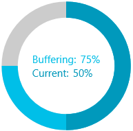
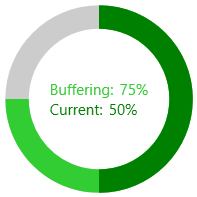

# Secondary Progress Indicator

`RadCircularProgressBar` allows you to visualize a second progress indicator. This is intended for scenarios where the primary indicator depends on the process of the secondary one. To display the second progress indicator, set the `SecondaryValue` property.

__Setting the SecondaryValue property__
<snippet id='radcircularprogressbar-secondary-indicator-setting_the_secondaryvalue_property-xaml' />

## Primary and Secondary Progress Indicator Colors

You can colorize the primary and secondary progress indicators of the control. To do so, set the `IndicatorFill` and `SecondaryIndicatorFill` properties.

__Setting the IndicatorFill and SecondaryIndicatorFill properties__
<snippet id='radcircularprogressbar-secondary-indicator-setting_the_indicatorfill_and_secondaryindicatorfill_properties-xaml' />

__The following image shows the result from the first code snippet when the IndicatorFill and SecondaryIndicatorFill properties are set__

## See Also
* [Color Ranges]()