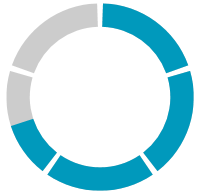
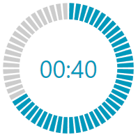

# Segments

`RadCircularProgressBar` allows you to split the progress track into multiple segments. To specify the segments' amount, set the `Segments` property to the desired count. This property is of type `int` and has a default value of __1__.

__Setting the segments' count__
```XAML
    <telerik:RadCircularProgressBar Value="0.7" Segments="5"/>
```

__Setting the segments' count in code__
```C#
    RadCircularProgressBar radCircularProgressBar = new RadCircularProgressBar();
    radCircularProgressBar.Value = 0.7;
    radCircularProgressBar.Segments = 5;
```
```VB.NET
    Dim radCircularProgressBar As RadCircularProgressBar = New RadCircularProgressBar()
    radCircularProgressBar.Value = 0.7
    radCircularProgressBar.Segments = 5
```

__RadCircularProgressBar split into 5 segments:__



## Segments Density

RadCircularProgressBar provides you with the ability to specify the density of the segments. To specify the desired density, set the `SegmentsDensity` property. The property is of type `int` and the value must be in the range between __0__ and __1__. The default value of the SegmentsDensity property is __0.95__.

__Setting the segments' density__
```XAML
    <telerik:RadCircularProgressBar Name="radCircularProgressBar" 
                                Maximum="60" 
                                Value="40"
                                SegmentsDensity="0.7" 
                                Segments="60">
        <telerik:RadCircularProgressBar.Content>
            <TextBlock Text="{Binding ElementName=radCircularProgressBar, Path=Value, StringFormat={}00:{0}}"
                       Foreground="{Binding ElementName=radCircularProgressBar, Path=IndicatorFill}"
                       FontSize="28" />
        </telerik:RadCircularProgressBar.Content>
    </telerik:RadCircularProgressBar>
```

__RadCircularProgressBar with modified segments' density:__



## Rounded Segments

RadCircularProgressBar allows you to round the edges of all of the segments. To apply this rounding, set the `UseRoundedSegments` property to __True__.

>important We highly recommend setting the `SegmentsDensity` property when using rounded segments.

__Rounding all segments__
```XAML
    <telerik:RadCircularProgressBar Value="0.75" Segments="4" SegmentsDensity="0.75" UseRoundedSegments="True"/>
```

__Rounding all segments in code__
```C#
    RadCircularProgressBar radCircularProgressBar = new RadCircularProgressBar();
    radCircularProgressBar.Value = 0.75;
    radCircularProgressBar.Segments = 4;
    radCircularProgressBar.SegmentsDensity = 0.75;
    radCircularProgressBar.UseRoundedSegments = true;
```
```VB.NET
    Dim radCircularProgressBar As RadCircularProgressBar = New RadCircularProgressBar()
    radCircularProgressBar.Value = 0.75
    radCircularProgressBar.Segments = 4
    radCircularProgressBar.SegmentsDensity = 0.75
    radCircularProgressBar.UseRoundedSegments = True
```

__RadCircularProgressBar with rounded segments:__


## See Also
* [States]()
* [Radiuses]()
* [Secondary Progress Indicator]()