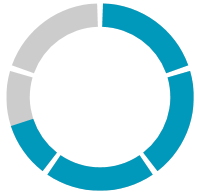
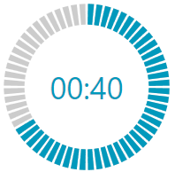

# Segments

`RadCircularProgressBar` allows you to split the progress track into multiple segments. To specify the segments' amount, set the `Segments` property to the desired count. This property is of type `int` and has a default value of __1__.

__Setting the segments' count__
<snippet id='radcircularprogressbar-segments-setting_the_segments_count-xaml' />

__Setting the segments' count in code__
<snippet id='radcircularprogressbar-segments-setting_the_segments_count_in_code-cs' />

<snippet id='radcircularprogressbar-segments-setting_the_segments_count_in_code-vb' />

__RadCircularProgressBar split into 5 segments:__

## Segments Density

RadCircularProgressBar provides you with the ability to specify the density of the segments. To specify the desired density, set the `SegmentsDensity` property. The property is of type `int` and the value must be in the range between __0__ and __1__. The default value of the SegmentsDensity property is __0.95__.

__Setting the segments' density__
<snippet id='radcircularprogressbar-segments-setting_the_segments_density-xaml' />

__RadCircularProgressBar with modified segments' density:__

## Rounded Segments

RadCircularProgressBar allows you to round the edges of all of the segments. To apply this rounding, set the `UseRoundedSegments` property to __True__.

>important We highly recommend setting the `SegmentsDensity` property when using rounded segments.

__Rounding all segments__
<snippet id='radcircularprogressbar-segments-rounding_all_segments-xaml' />

__Rounding all segments in code__
<snippet id='radcircularprogressbar-segments-rounding_all_segments_in_code-cs' />

<snippet id='radcircularprogressbar-segments-rounding_all_segments_in_code-vb' />

__RadCircularProgressBar with rounded segments:__

## See Also
* [States]()
* [Radiuses]()
* [Secondary Progress Indicator]()