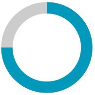
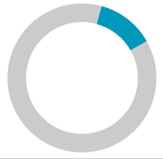

# States

`RadCircularProgressBar` supports two types of operation modes. Each of these modes is aimed at different scenarios.

## Determinate State

This mode of operation is intended for scenarios where the RadCircularProgressBar's progress can be measured precisely. This state is the default one.

>tip Set the `IsIndeterminate` property of RadCircularProgressBar to __False__ to use this state if it is not the active one.

__Setting the determinate state__
```XAML
    <telerik:RadCircularProgressBar Name="radCircularProgressBar" Value="0.75" IsIndeterminate="False"/>
```

__Setting the determinate state in code__
```C#
    RadCircularProgressBar radCircularProgressBar = new RadCircularProgressBar();
    radCircularProgressBar.Value = 0.75;
    radCircularProgressBar.IsIndeterminate = false;
```
```VB.NET
    Dim radCircularProgressBar As RadCircularProgressBar = New RadCircularProgressBar()
    radCircularProgressBar.Value = 0.75
    radCircularProgressBar.IsIndeterminate = False
```

__Determinate state__



## Indeterminate State

This state is aimed at scenarios where the operation progress cannot be precisely measured. When this mode is active, a circular animation of the progress will be played. To active this mode, set the `IsIndeterminate` property of RadCircularProgressBar to __True__.

__Setting the indeterminate state__
```XAML
    <telerik:RadCircularProgressBar Name="radCircularProgressBar" IsIndeterminate="True"/>
```

__Setting the indeterminate state in code__
```C#
    RadCircularProgressBar radCircularProgressBar = new RadCircularProgressBar();
    radCircularProgressBar.IsIndeterminate = true;
```
```VB.NET
    Dim radCircularProgressBar As RadCircularProgressBar = New RadCircularProgressBar()
    radCircularProgressBar.IsIndeterminate = True
```

__Indeterminate state__



## IndeterminateIndicatorRatio

RadCircularProgressBar allows you to modify the ratio of the progress indicator, when the control is in indeterminate state. To do so, set the `IndeterminateIndicatorRatio` property. The accepted values are in the ranges between __0__ and __1__. The default value of this property is __0.125__.

__Setting the IndeterminateIndicatorRatio__
```XAML
    <telerik:RadCircularProgressBar Name="circularProgressBar" IsIndeterminate="True" IndeterminateIndicatorRatio="0.75"/>
```

__Setting the IndeterminateIndicatorRatio in code__
```C#
    RadCircularProgressBar radCircularProgressBar = new RadCircularProgressBar();
    radCircularProgressBar.IsIndeterminate = true;
    radCircularProgressBar.IndeterminateIndicatorRatio = 0.75;
```
```VB.NET
    Dim radCircularProgressBar As RadCircularProgressBar = New RadCircularProgressBar()
    radCircularProgressBar.IsIndeterminate = True
    radCircularProgressBar.IndeterminateIndicatorRatio = 0.75
```

## See Also
* [Segments]()