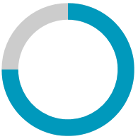
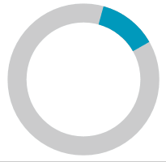

# States

`RadCircularProgressBar` supports two types of operation modes. Each of these modes is aimed at different scenarios.

## Determinate State

This mode of operation is intended for scenarios where the RadCircularProgressBar's progress can be measured precisely. This state is the default one.

>tip Set the `IsIndeterminate` property of RadCircularProgressBar to __False__ to use this state if it is not the active one.

__Setting the determinate state__
<snippet id='radcircularprogressbar-states-setting_the_determinate_state-xaml' />

__Setting the determinate state in code__
<snippet id='radcircularprogressbar-states-setting_the_determinate_state_in_code-cs' />

<snippet id='radcircularprogressbar-states-setting_the_determinate_state_in_code-vb' />

__Determinate state__

## Indeterminate State

This state is aimed at scenarios where the operation progress cannot be precisely measured. When this mode is active, a circular animation of the progress will be played. To active this mode, set the `IsIndeterminate` property of RadCircularProgressBar to __True__.

__Setting the indeterminate state__
<snippet id='radcircularprogressbar-states-setting_the_indeterminate_state-xaml' />

__Setting the indeterminate state in code__
<snippet id='radcircularprogressbar-states-setting_the_indeterminate_state_in_code-cs' />

<snippet id='radcircularprogressbar-states-setting_the_indeterminate_state_in_code-vb' />

__Indeterminate state__

## IndeterminateIndicatorRatio

RadCircularProgressBar allows you to modify the ratio of the progress indicator, when the control is in indeterminate state. To do so, set the `IndeterminateIndicatorRatio` property. The accepted values are in the ranges between __0__ and __1__. The default value of this property is __0.125__.

__Setting the IndeterminateIndicatorRatio__
<snippet id='radcircularprogressbar-states-setting_the_indeterminateindicatorratio-xaml' />

__Setting the IndeterminateIndicatorRatio in code__
<snippet id='radcircularprogressbar-states-setting_the_indeterminateindicatorratio_in_code-cs' />

<snippet id='radcircularprogressbar-states-setting_the_indeterminateindicatorratio_in_code-vb' />

## See Also
* [Segments]()