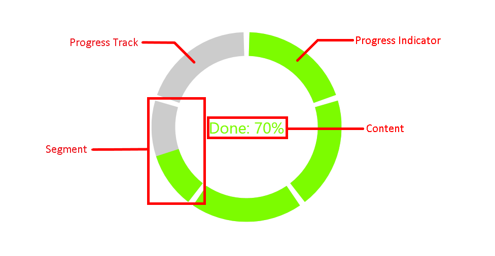

# {{ site.framework_name }} RadCircularProgressBar Visual Structure

This section defines terms and concepts used in the scope of the `RadCircularProgressBar` control with which you have to get familiar before you continue to read its documentation. They can also be helpful when contacting our support service in order to describe your issue better.

* __Progress Indicator__&mdash;Indicates the current status of the progress.
* __Progress Track__&mdash;Holder of the progress indicator used to hold and contract the progress.
* __Segment__&mdash;Indicates the segment of RadCircularProgressBar.
* __Content__&mdash;Represents the value set to the `Content` property.

>tip Get started with the control with its [Getting Started]() help article that shows how to use it in a basic scenario.

## See Also
* [Getting Started]()
