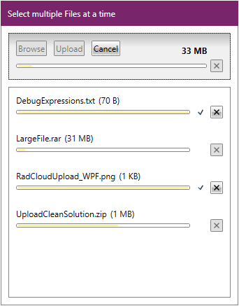

# Overview

The __RadCouldUpload__ control can be used in scenarios when our customers need to allow their users to upload files to a cloud storage provider. This control can be configured to upload files to different storage providers.

## Key Features

* __Multiple Files Upload__: To save the user’s time and efforts, __RadCloudUpload__ allows upload of several files at the same time by setting a single property through its multiple files upload feature. 

* __Styling and Appearance__: The visual appearance of the control can be fully customized. There are also several pre-defined themes that can be used to stylize the upload control.

* __Automatic Upload__: Automatically upload the files right after the latter have been selected in the “Open” dialog.

>tip Get started with the control with its [Getting Started]() help article that shows how to use it in a basic scenario.

> Download the UI for WPF demos and see the CloudUpload examples at [demos.telerik.com](https://demos.telerik.com/wpf/).

## See Also   
 * [Visual Structure]()
 * [Providers]()

 