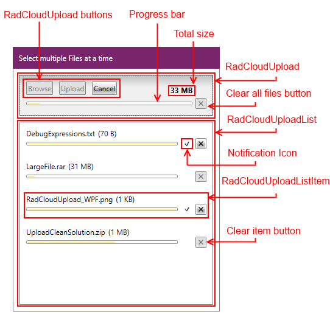

# Visual Structure

## 

Thank you for choosing __RadCloudUpload__.

This section defines terms and concepts used in the scope of __RadCloudUpload__ you have to get familiar with prior to continue reading this help.

Below you can see a snapshot and explanation of the main visual elements of the __RadCloudUpload__ control.

The structure of a __RadCloudUpload__ consists of the following main elements:

* __RadCloudUpload__ - a Control which uses your custom provider to upload files to the cloud storage.
            

* __RadCloudUploadList__ - a separate ItemsControl that hosts the __RadCloudUploadListItems__.
            

* __RadCloudUploadListItem__ - a Control that represents a single file and indicates its status.
            

* __Notification Icon__ - icon indicating the state of the __RadUploadListItem__. The state can be one of the following:
            

* __Uploaded__ - in this state the icon is changed to a tick and it indicates that the file is uploaded.
                

* __Failed__ - in this state the icon is changed to an orange triangle and it indicates that the file has failed uploading.
                

* __Canceling__ - in this state the icon is changed to an orange triangle and it indicates that the cancelation request has been sent to the cloud provider.
                

* __Canceled__ - in this state the icon is changed to an orange triangle and it indicates that the uploading is canceled.
                

# See Also

 * [Template Structure]()

 * [Providers]()
