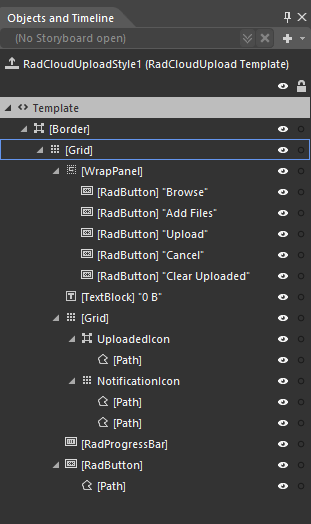
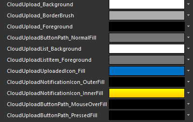

# Template Structure

Like most WPF controls, the __RadCloudUpload__ also allows you to customize it in order to change the control from the inside. Except for templating the control itself, you can template parts of it or even independent controls related to it.
      

## RadCloudUpload Template structure

This section will explain the structure of the __RadUpload__'s template. Here is a snapshot of the template generated in Expression Blend.
        

It contains the following parts:

* __[Border]__ - represents the outer border of the __RadCloudUpload__.
            

* __[Grid]__ - hosts the template elements.
                

* __[WrapPanel]__ - hosts the buttons used in the control.
                    

* __[RadButton]__ - *Browse* represents the __Browse__ button used to open a file dialog.(This buttons clears the selected items)
                        

* __[RadButton]__ - *Add Files* represents the __Add Files__ button used to open a file dialog.(This buttons adds files to the selected items)
                        

* __[RadButton]__ - *Upload* represents the __Upload__ button used to start the upload session.
                        

* __[RadButton]__ - *Cancel* represents the __Cancel__ button used to request a cancel.
                        

* __[RadButton]__ - *ClearUpload* represents the __ClearUpload__ button used to request a cancel.
                        

* __[TextBlock]__ - represents the TotalSize (bytes) of the items size in the current upload session.
                    

* __[Grid]__ - hosts the notification and uploaded Paths.
                    

* __[Border]__ - hosts the upload path.
                        

* __[Path]__ - represents the shape of the uploaded icon.
                            

* __[Grid]__ - hosts the error path
                        

* __[Path]__ - represents the shape of the error icon.
                            

* __[Path]__ - represents the shape of the error icon.
                            

* __[ProgressBar]__ - indicates the total progress of the upload.
                    

* __[RadButton]__ - *Clear* represents the __Clear__ button which hosts the clear path.
                  

## Styling the RadCloudUpload

* CloudUpload_Background - a brush that represents the background of the __RadCloudUpload__ control.

* CloudUpload_BorderBrush - a brush that represents the border color of the __RadCloudUpload__ control

* CloudUpload_Foregound - a brush that represents the foreground color of the TextBlock element in the __RadCloudUpload__.
          

* CloudUploadButtonPath_NormalFill - a brush that represents the color of the Path’s located in the buttons in the __RadCloudUpload__.
          

* CloudUploadUploadedIcon_Fill  - a brush that represents the color of the UploadedPath element in the __RadCloudUpload__.
          

* CloudUploadList_Background - a brush that represents the background of the __RadCloudUploadList__ control.

* CloudUploadListItem_Foregound - a brush that represents the foreground of the __RadCloudUploadListItem__ control.

* CloudUploadNotificationIcon_OuterFill - a brush that represents the outer fill color of the __RadCloudUpload__ notification icon. 

* CloudUploadNotificationIcon_InnerFill - a brush that represents the inner fill color of the __RadCloudUpload__ notification icon.

# See Also

 * [Visual Structure]()

 * [Providers]()
