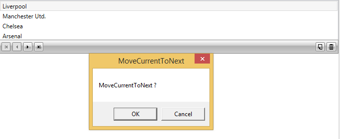

# Customizing Commands

This article provides a description and examples of how to customize RadCollectionNavigator’s commands in a MVVM-friendly way.

>Please note that Telerik introduced this functionality in Q1 2016.

The __CollectionNavigatorBaseCommandProvider__ is a public class that exposes the “execute” and “can-execute” logic of all commands used by RadCollectionNavigator. RadCollectionNavigator processes these commands according to its current provider.

## Execute logic methods

The methods listed below in __Example 1__ identify the logic that is executed when a certain command’s invocation takes place.

__Example 1: RadCollectionNavigator's executable commands__

```C#
	void MoveCurrentToFirst();
	void MoveCurrentToLast();
	void MoveCurrentToNext();
	void MoveCurrentToPrevious();
	void BeginEdit();
	void Delete();
	void AddNew();
```
```VB.NET
	Sub MoveCurrentToFirst()
	Sub MoveCurrentToLast()
	Sub MoveCurrentToNext()
	Sub MoveCurrentToPrevious()
	Sub BeginEdit()
	Sub Delete()
	Sub AddNew()
```
	
## Can-execute logic methods

With the help of the methods listed in __Example 2__ you can identify whether a certain command can be executed or not.

__Example 2:RadCollectionNavigator "can-execute" methods__ 

```C#
	bool CanMoveCurrentToFirstExecute();
	bool CanMoveCurrentToLastExecute();
	bool CanMoveCurrentToNextExecute();
	bool CanMoveCurrentToPreviousExecute();
	bool CanBeginEditExecute();
	bool CanDeleteExecute();
	bool CanAddNewExecute();
```
```VB.NET
	Function CanMoveCurrentToFirstExecute() As Boolean
	Function CanMoveCurrentToLastExecute() As Boolean
	Function CanMoveCurrentToNextExecute() As Boolean
	Function CanMoveCurrentToPreviousExecute() As Boolean
	Function CanBeginEditExecute() As Boolean
	Function CanDeleteExecute() As Boolean
	Function CanAddNewExecute() As Boolean
```

## Designing a custom CommandProvider

The first step is to create your own class that inherits from CollectionNavigatorBaseCommandProvider.

__Example 3: Creating a class that provides the custom commands__

```C#
	public class CustomCommandProvider : CollectionNavigatorBaseCommandProvider
	{
	    public CustomCommandProvider() : base(null)
	    {
	    }
	    public CustomCommandProvider(RadCollectionNavigator collectionNavigator)
	        : base(collectionNavigator)
	    {
	    }
	    //. . .
	}
```
```VB.NET
	Public Class CustomCommandProvider
	    Inherits CollectionNavigatorBaseCommandProvider
	    Public Sub New()
	        MyBase.New(Nothing)
	    End Sub
	    Public Sub New(ByVal collectionNavigator As RadCollectionNavigator)
	        MyBase.New(collectionNavigator)
	    End Sub
	    '. . .
	End Class
```

You need to override the methods of the commands that will be customized. In the following example we will customize: MoveCurrentToNext, MoveCurrentToPrevious.

## MoveCurrentToNext and MoveCurrentToPrevious

If we have a requirement to prompt for the user's approval when moving through the items, the following change in the methods can be done:

__Example 4: Overriding the default commands__ 

```C#
	public override void MoveCurrentToNext()
	{
	    MessageBoxResult result = MessageBox.Show("MoveCurrentToNext ?", "MoveCurrentToNext", MessageBoxButton.OKCancel);
	    if (result == MessageBoxResult.OK)
	    {
	        this.CollectionNavigator.MoveCurrentToNext();
	    }
	}
	public override void MoveCurrentToPrevious()
	{
	    MessageBoxResult result = MessageBox.Show("MoveCurrentToPrevious ?", "MoveCurrentToPrevious", MessageBoxButton.OKCancel);
	    if (result == MessageBoxResult.OK)
	    {
	        this.CollectionNavigator.MoveCurrentToPrevious();
	    }
	}
```
```VB.NET
	Public Overrides Sub MoveCurrentToNext()
	    Dim result As MessageBoxResult = MessageBox.Show("MoveCurrentToNext ?", "MoveCurrentToNext", MessageBoxButton.OKCancel)
	    If result = MessageBoxResult.OK Then
	        Me.CollectionNavigator.MoveCurrentToNext()
	    End If
	End Sub
	Public Overrides Sub MoveCurrentToPrevious()
	    Dim result As MessageBoxResult = MessageBox.Show("MoveCurrentToPrevious ?", "MoveCurrentToPrevious", MessageBoxButton.OKCancel)
	    If result = MessageBoxResult.OK Then
	        Me.CollectionNavigator.MoveCurrentToPrevious()
	    End If
	End Sub
```

The last thing to be done is to set the CommandProvider property of the RadCollectionNavigator to be the newly-created CustomCommandProvider class.

__Example 5: Assigning the CommandProvider__ 

```XAML
	<telerik:RadCollectionNavigator x:Name="CollectionNavigator"
	              			Source="{Binding Employees}"/>
```

__Example 5: Assigning the CommandProvider__ 

```C#
	this.CollectionNavigator.CommandProvider = new CustomCommandProvider(this.CollectionNavigator);
```
```VB.NET
	Me.CollectionNavigator.CommandProvider = New CustomCommandProvider(Me.CollectionNavigator)
```

Modifying the methods will result in the action shown in the image below when trying to move to the next item:

#### __Figure 1: RadCollectionNavigator with customized MoveCurrentToNext command__



## See Also

* [Overview]()

* [Getting Started]()
