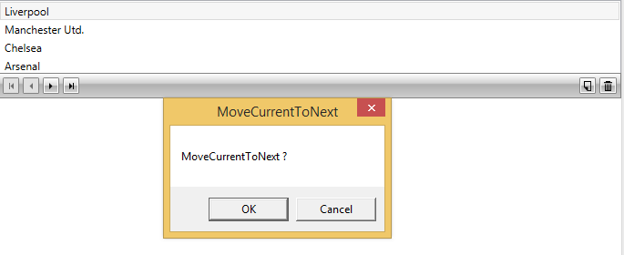

# Customizing Commands

This article provides a description and examples of how to customize RadCollectionNavigator’s commands in a MVVM-friendly way.

>Please note that Telerik introduced this functionality in Q1 2016.

The __CollectionNavigatorBaseCommandProvider__ is a public class that exposes the “execute” and “can-execute” logic of all commands used by RadCollectionNavigator. RadCollectionNavigator processes these commands according to its current provider.

## Execute logic methods

The methods listed below in __Example 1__ identify the logic that is executed when a certain command’s invocation takes place.

__Example 1: RadCollectionNavigator's executable commands__

<snippet id='radcollectionnavigator-features-customize-commands-example_1_radcollectionnavigator_s_executable_commands-cs' />

<snippet id='radcollectionnavigator-features-customize-commands-example_1_radcollectionnavigator_s_executable_commands-vb' />

	
## Can-execute logic methods

With the help of the methods listed in __Example 2__ you can identify whether a certain command can be executed or not.

__Example 2:RadCollectionNavigator "can-execute" methods__ 

<snippet id='radcollectionnavigator-features-customize-commands-example_2_radcollectionnavigator_can_execute_methods-cs' />

<snippet id='radcollectionnavigator-features-customize-commands-example_2_radcollectionnavigator_can_execute_methods-vb' />

## Designing a custom CommandProvider

The first step is to create your own class that inherits from CollectionNavigatorBaseCommandProvider.

__Example 3: Creating a class that provides the custom commands__

<snippet id='radcollectionnavigator-features-customize-commands-example_3_creating_a_class_that_provides_the_custom_commands-cs' />

<snippet id='radcollectionnavigator-features-customize-commands-example_3_creating_a_class_that_provides_the_custom_commands-vb' />

You need to override the methods of the commands that will be customized. In the following example we will customize: MoveCurrentToNext, MoveCurrentToPrevious.

## MoveCurrentToNext and MoveCurrentToPrevious

If we have a requirement to prompt for the user's approval when moving through the items, the following change in the methods can be done:

__Example 4: Overriding the default commands__ 

<snippet id='radcollectionnavigator-features-customize-commands-example_4_overriding_the_default_commands-cs' />

<snippet id='radcollectionnavigator-features-customize-commands-example_4_overriding_the_default_commands-vb' />

The last thing to be done is to set the CommandProvider property of the RadCollectionNavigator to be the newly-created CustomCommandProvider class.

__Example 5: Assigning the CommandProvider__ 

<snippet id='radcollectionnavigator-features-customize-commands-example_5_assigning_the_commandprovider-xaml' />

__Example 5: Assigning the CommandProvider__ 

<snippet id='radcollectionnavigator-features-customize-commands-example_5_assigning_the_commandprovider-cs' />

<snippet id='radcollectionnavigator-features-customize-commands-example_5_assigning_the_commandprovider-vb' />

Modifying the methods will result in the action shown in the image below when trying to move to the next item:

#### __Figure 1: RadCollectionNavigator with customized MoveCurrentToNext command__

## See Also

* [Overview]()

* [Getting Started]()
