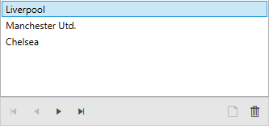

# Getting Started with {{ site.framework_name }} CollectionNavigator

__RadCollectionNavigator__’s main purpose is to expose some of the methods of [ICollectionView](https://docs.microsoft.com/en-us/dotnet/api/system.componentmodel.icollectionview?view=netframework-4.8)/[IEditableCollectionView](https://docs.microsoft.com/en-us/dotnet/api/system.componentmodel.ieditablecollectionview?view=netframework-4.8) through its UI and public commands.

RadCollectionNavigator’s __Source__ property accepts __IEnumerable__ values and manages them as follows: If the underlying value implements __ICollectionView__, the current implementation of its methods is used. If it does __not__, a new instance of Telerik’s [QueryableCollectionView](https://docs.telerik.com/devtools/wpf/api/telerik.windows.data.queryablecollectionview) (which implements both interfaces) is initialized, using the Source value as its __SourceCollection__.

In either case, the used ICollectionView is exposed through the control’s __CollectionView__ property. By binding an ItemsControl’s __ItemsSource__ to this property one can benefit from seamless, MVVM-compatible and data-driven collection processing for any ItemsControls and any collection (even for custom ICollectionView implementations).

## Assembly References

In order to use __RadCollectionNavigator__, you will need to add references to the following assemblies:

* __Telerik.Licensing.Runtime__
* __Telerik.Windows.Controls__
* __Telerik.Windows.Controls.Data__
* __Telerik.Windows.Data__

You can find the required assemblies for each control from the suite in the [Controls Dependencies]()[Controls Dependencies]() help article.

>tip With the 2025 Q1 release, the Telerik UI for WPF has a new licensing mechanism. You can learn more about it [here]().

### Adding Telerik Assemblies Using NuGet

To use __RadCollectionNavigator__ when working with NuGet packages, install the `Telerik.Windows.Controls.Data.for.Wpf.Xaml` package. The [package name may vary]() slightly based on the Telerik dlls set - [Xaml or NoXaml]()

Read more about NuGet installation in the [Installing UI for WPF from NuGet Package]() article.

## Defining RadCollectionNavigator

__Examples 1__ demonstrate how to utilize the CollectionView exposed by the RadCollectionNavigator.

> The __MyViewModel__ class used in __Example 1__ is defined in __Example 4__ in the following [article]().

#### __[XAML] Example 1: RadCollectionNavigator bound to a ListBox__

{{region xaml-collectionnavigator-getting-started_0}}
	<Grid x:Name="LayoutRoot"
		  Background="White">
		<Grid.DataContext>
			<my:MyViewModel />
		</Grid.DataContext>
		<Grid.RowDefinitions>
			<RowDefinition Height="*"/>
			<RowDefinition Height="Auto" />
		</Grid.RowDefinitions>
		<ListBox
			DisplayMemberPath="Name"
			SelectedItem="{Binding ElementName=collectionNavigator, Path=CurrentItem, Mode=TwoWay}"
			ItemsSource="{Binding ElementName=collectionNavigator, Path=CollectionView}" />
		<telerik:RadCollectionNavigator
			Source="{Binding Clubs}"
			Grid.Row="1"
			x:Name="collectionNavigator"/>
	</Grid>
{{endregion}}

#### __Figure 1: RadCollectionNavigator in the Fluent theme__

## Setting a Theme

The controls from our suite support different themes. You can see how to apply a theme different than the default one in the [Setting a Theme]() help article.

>important Changing the theme using implicit styles will affect all controls that have styles defined in the merged resource dictionaries. This is applicable only for the controls in the scope in which the resources are merged. 

To change the theme, you can follow the steps below:

* Choose between the themes and add reference to the corresponding theme assembly (ex: **Telerik.Windows.Themes.Fluent.dll**). You can see the different themes applied in the **Theming** examples from our [WPF Controls Examples](https://demos.telerik.com/wpf/)[Silverlight Controls Examples](https://demos.telerik.com/silverlight/#CollectionNavigator/Theming) application.

* Merge the ResourceDictionaries with the namespace required for the controls that you are using from the theme assembly. For the __RadAutoCompleteBox__, you will need to merge the following resources:

	* __Telerik.Windows.Controls__
	* __Telerik.Windows.Controls.Data__

__Example 2__ demonstrates how to merge the ResourceDictionaries so that they are applied globally for the entire application.

#### __[XAML] Example 2: Merge the ResourceDictionaries__  
{{region xaml-collectionnavigator_getting_started_1}}
	<Application.Resources>
		<ResourceDictionary>
			<ResourceDictionary.MergedDictionaries>
				<ResourceDictionary Source="/Telerik.Windows.Themes.Fluent;component/Themes/System.Windows.xaml"/>
				<ResourceDictionary Source="/Telerik.Windows.Themes.Fluent;component/Themes/Telerik.Windows.Controls.xaml"/>
				<ResourceDictionary Source="/Telerik.Windows.Themes.Fluent;component/Themes/Telerik.Windows.Controls.Data.xaml"/>
			</ResourceDictionary.MergedDictionaries>
		</ResourceDictionary>
	</Application.Resources>
{{endregion}}

>Alternatively, you can use the theme of the control via the [StyleManager](https://docs.telerik.com/devtools/wpf/styling-and-appearance/stylemanager/common-styling-apperance-setting-theme-wpf)[StyleManager](https://docs.telerik.com/devtools/silverlight/styling-and-appearance/stylemanager/common-styling-apperance-setting-theme).

__Figure 2__ shows a __RadCollectionNavigator__ with the **Fluent** theme applied.
	
#### __Figure 2: RadCollectionNavigator with the Fluent theme__


## Telerik UI for WPF Learning Resources

* [Telerik UI for WPF CollectionNavigator Component](https://www.telerik.com/products/wpf/collection-navigator.aspx)
* [Getting Started with Telerik UI for WPF Components]()
* [Telerik UI for WPF Installation]()
* [Telerik UI for WPF and WinForms Integration]()
* [Telerik UI for WPF Visual Studio Templates]()
* [Setting a Theme with Telerik UI for WPF]()
* [Telerik UI for WPF Virtual Classroom (Training Courses for Registered Users)](https://learn.telerik.com/learn/course/external/view/elearning/16/telerik-ui-for-wpf) 
* [Telerik UI for WPF License Agreement](https://www.telerik.com/purchase/license-agreement/wpf-dlw-s)


## See Also

* [Overview]()

* [Visual Structure]()
