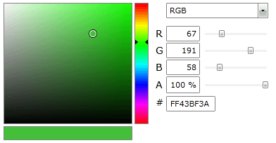
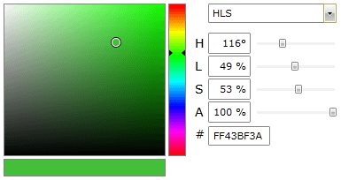
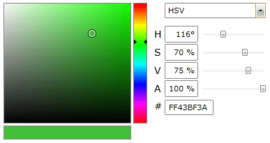
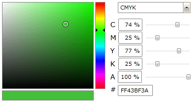

# Color Mode

The __RadColorEditor__ control allows supports the most popular color models. You can choose which one to use by setting the  __ColorMode__ property.

The __ColorMode__ property is an enumeration of type __ColorMode__ and it exposed the following members:				

__Example 1: Set the color model to RGB__
```XAML
	<telerik:RadColorEditor x:Name="colorEditor" SelectedColor="Red" ColorMode="RGB"/>
```

* __RGB__: Sets the color model to [RGB(Red, Green and Blue)](http://en.wikipedia.org/wiki/RGB_color_model)  
	

	__Example 2: Set the color model to HLS__
	```XAML
		<telerik:RadColorEditor x:Name="colorEditor" SelectedColor="Green" ColorMode="HLS"/>
	```

* __HLS__: Sets the color model to [HLS (Hue, Luminance and Saturation)](http://en.wikipedia.org/wiki/HSL_and_HSV)  
	

	__Example 3: Set the color model to HSV__
	```XAML
		<telerik:RadColorEditor x:Name="colorEditor" SelectedColor="Green" ColorMode="HSV"/>
	```

* __HSV__: Sets the color model to [HSV (Hue, Saturation and Value)](http://en.wikipedia.org/wiki/HSL_and_HSV)  
	

	__Example 4: Set the color model to CMYK__
	```XAML
		<telerik:RadColorEditor x:Name="colorEditor" SelectedColor="Green" ColorMode="CMYK"/>
	```

* __CMYK__: Sets the color model to [CMYK (Cyan, Magenta, Yellow and Key/Black)](http://en.wikipedia.org/wiki/Cmyk)  
	

## See Also
 * [Structure]()
 * [Getting Started]()
