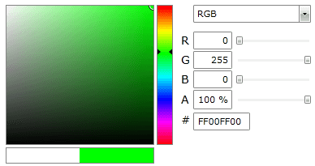

# Unified Color

__RadColorEditor’s UnifiedColor__ property represents an entity that exposes all the values of a color in the different color models.

If the __RadColorEditor SelectedColor__ is set to __Magenta__, the __UnifiedColor__ property will expose the value of the __Magenta__ color in each color model. 


```XAML
	<telerik:RadColorEditor x:Name="colorEditor1" SelectedColor="Magenta" />
```


>If you set the __UnifiedColor__ property its value will immediately reflect on the __SelectedColor__ property value.



## See Also
 * [Structure]()
 * [Getting Started]()
 * [Color Mode]()
 * [Color History]()