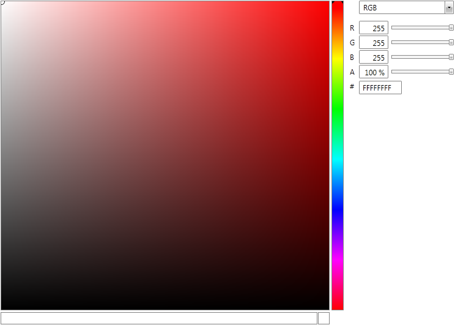

# Overview



## 

Thank you for choosing Telerik __RadColorEditor!__ 

__RadColorEditor__ for SilverlightWPF  is a lightweight UI component that allows users to select color from a custom  palette of colors.
