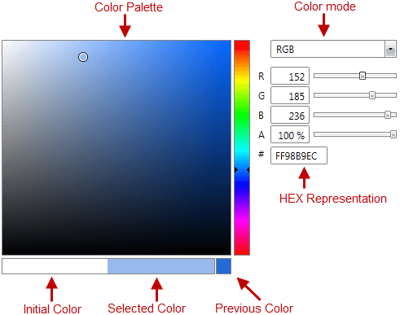

# Structure

This section defines terms and concepts used in the scope of __RadColorEditor__ you have to get familiar with before you continue reading this help. They can also be helpful when contacting our support service in order to describe your issue better.

* __Color Pallette__ 
* __Color Mode__ 
* __Previous Color__ 
* __Selected Color__ 
* __Hex Representation__

# See Also
 * [Overview]()