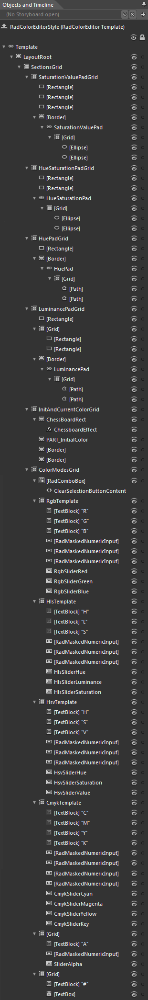

# Template Structure

## 

* __LayoutRoot__ - is of type __Grid__ and represents the layout root for the template.
				  

* __SectionsGrid__ - is of type __Grid__ and contains all selection elements.
					  

* __SaturationValuePadGrid__ - is of type __Grid__ and contains the __ColorPalette__.
						  

* __[Rectangle]__ - is of type __Rectangle__ and holds the main color.
							  

* __[Rectangle]__ - is of type __Rectangle__ and holds the transparency of the main color.
							  

* __[Rectangle]__ - is of type __Rectangle__ and holds the darkness of the main color.
							  

* __[Border]__ - is of type __Border__ and wraps the __Pad__ which controls the chosen color.
							  

* __SaturationValuePad__ - is of type __Pad__ and represents the control that processes the chosen color.
								  

* __[Grid]__ - is of type __Grid__ and hosts the selection thumb.
									  

* __[Ellipse]__ - is of type __Ellipse__ and represents the outer circle of the thumb.
										  

* __[Ellipse]__ - is of type __Ellipse__ and represents the inner circle of the thumb.
										  

* __HueSaturationPadGrid__ - is of type __Grid__ and hosts the SaturationValuePad section.
						  

* __[Rectangle]__ - is of type __Rectangle__ and represents the multicolor rectangle.
							  

* __[Rectangle]__ - is of type __Rectangle__ and represents the gray rectangle.
							  

* __SaturationValuePad__ - is of type __Pad__ and processes the selected color.
							  

* __[Grid]__ - is of type __Grid__ and hosts the selection thumb.
								  

* __[Ellipse]__ - is of type __Ellipse__ and represents the outer circle of the thumb.
									  

* __[Ellipse]__ - is of type __Ellipse__ and represents the inner circle of the thumb.
									  

* __HuePadGrid__ - is of type __Grid__ and hosts the vertical multicolor rectangle.
						  

* __[Rectangle]__ - is of type __Rectangle__ and represents the vertical multicolor rectangle.
							  

* __[Border]__ - is of type __Border__ and wraps the __Pad__ control.
							  

* __HuePad__ - is of type __Pad__ and processes the selected color.
								  

* __[Grid]__ - is of type __Grid__ and hosts the selection thumb.
									  

* __[Path]__ - is of type __Path__ and represents the left part of the selection thumb.
										  

* __[Path]__ - is of type __Path__ and represents the right part of the selection thumb.
										  

* __LuminancePadGrid__ - is of type __Grid__ and hosts the LuminancePad section.
						  

* __[Rectangle]__ - is of type __Rectangle__ and represents the gray part of the scale.
							  

* __[Grid]__ - is of type __Grid__ and hosts the white and black parts of the scale.
							  

* __[Rectangle]__ - is of type __Rectangle__ and represents the white part of the scale.
								  

* __[Rectangle]__ - is of type __Grid__ and represents the black part of the scale.
								  

* __[Border]__ - is of type __Border__ and wraps the Pad control.
							  

* __[LuminancePad]__ - is of type __Pad__ and processes the selected luminance.
								  

* __[Grid]__ - is of type __Grid__ and hosts the selection thumb.
									  

* __[Path]__ - is of type __Path__ and represents the outer circle of the selection thumb.
										  

* __[Path]__ - is of type __Path__ and represents the inner circle of the selection thumb.
										  

* __InitAndCurrentColorGrid__ - is of type __Grid__ and hosts the __Borders__ representing the initial, the selected and the previous colors.
						  

* __ChessBoardRect__ - is of type __Border__ and it is visualized when transparency is added to the initial and the selected colors.
							  

* __ChessboardEffect__  - is of type __ChessboardEffect__ and it is visualized when transparency is added to the initial and the selected colors.
								  

* __PART_InitialColor__ - is of type __Border__ and represents the initial color.
							  

* __[Border]__ - is of type __Border__ and represents the selected color.
							  

* __[Border]__ - is of type __Border__ and represents the previous color.
							  

* __ColorModesGrid__ - is of type __Grid__ and hots
						  

* __[RadComboBox]__ - is of type __RadComboBox__ and it is used to switch between the edit modes.
							  

* __ClearSelectionButtonContent__

* __RgbTemplate__ - is of type __Grid__ and hosts all components needed in RGB edit mode.
							  

* __[TextBlock] "R"__ - is of type __TextBlock__ and displays the "R" symbol.
								  

* __[TextBlock] "G"__ - is of type __TextBlock__ and displays the "G" symbol.
								  

* __[TextBlock] "B"__ - is of type __TextBlock__ and displays the "B" symbol.
								  

* __[RadMaskedNumericInput]__ - is of type __RadMaskedNumericInput__ and displays/controls the R component of the color.
								  

* __[RadMaskedNumericInput]__ - is of type __RadMaskedNumericInput__ and displays/controls the G component of the color.
								  

* __[RadMaskedNumericInput]__ - is of type __RadMaskedNumericInput__ and displays/controls the B component of the color.
								  

* __RgbSliderRed__ - is of type __RadSlider__ and changes the R component of the color.
								  

* __RgbSliderGreen__ - is of type __RadSlider__ and changes the G component of the color.
								  

* __RgbSliderBlue__ - is of type __RadSlider__ and changes the B component of the color.
								  

* __HlsTemplate__ - is of type __Grid__ and hosts all components needed in HLS edit mode.
							  

* __[TextBlock] "H"__ - is of type __TextBlock__ and displays the "H" symbol.
								  

* __[TextBlock] "L"__ - is of type __TextBlock__ and displays the "L" symbol.
								  

* __[TextBlock] "S"__ - is of type __TextBlock__ and displays the "S" symbol.
								  

* __[RadMaskedNumericInput]__ - is of type __RadMaskedNumericInput__ and displays/controls the H component of the color.
								  

* __[RadMaskedNumericInput]__ - is of type __RadMaskedNumericInput__ and displays/controls the L component of the color.
								  

* __[RadMaskedNumericInput]__ - is of type __RadMaskedNumericInput__ and displays/controls the S component of the color.
								  

* __HlsSliderHue__ - is of type __RadSlider__ and changes the H component of the color.
								  

* __HlsSliderLuminance__ - is of type __RadSlider__ and changes the L component of the color.
								  

* __HlsSliderSaturation__ - is of type __RadSlider__ and changes the S component of the color.
								  

* __HsvTemplate__ - is of type __Grid__ and hosts all components needed in HSV edit mode.
							  

* __[TextBlock] "H"__ - is of type __TextBlock__ and displays the "H" symbol.
								  

* __[TextBlock] "S"__ - is of type __TextBlock__ and displays the "S" symbol.
								  

* __[TextBlock] "V"__ - is of type __TextBlock__ and displays the "V" symbol.
								  

* __[RadMaskedNumericInput]__ - is of type __RadMaskedNumericInput__ and displays/controls the H component of the color.
								  

* __[RadMaskedNumericInput]__ - is of type __RadMaskedNumericInput__ and displays/controls the S component of the color.
								  

* __[RadMaskedNumericInput]__ - is of type __RadMaskedNumericInput__ and displays/controls the V component of the color.
								  

* __HsvSliderHue__ - is of type __RadSlider__ and changes the H component of the color.
								  

* __HsvSliderSaturation__ - is of type __RadSlider__ and changes the S component of the color.
								  

* __HsvSliderValue__ - is of type __RadSlider__ and changes the V component of the color.
								  

* __CmykTemplate__ - is of type __Grid__ and hosts all components needed in CMYK edit mode.
							  

* __[TextBlock] "C"__ - is of type __TextBlock__ and displays the "C" symbol.
								  

* __[TextBlock] "M"__ - is of type __TextBlock__ and displays the "M" symbol.
								  

* __[TextBlock] "Y"__ - is of type __TextBlock__ and displays the "Y" symbol.
								  

* __[TextBlock] "K"__ - is of type __TextBlock__ and displays the "K" symbol.
								  

* __[RadMaskedNumericInput]__ - is of type __RadMaskedNumericInput__ and displays/controls the C component of the color.
								  

* __[RadMaskedNumericInput]__ - is of type __RadMaskedNumericInput__ and displays/controls the M component of the color.
								  

* __[RadMaskedNumericInput]__ - is of type __RadMaskedNumericInput__ and displays/controls the Y component of the color.
								  

* __[RadMaskedNumericInput]__ - is of type __RadMaskedNumericInput__ and displays/controls the K component of the color.
								  

* __CmykSliderCyan__ - is of type __RadSlider__ and changes the C component of the color.
								  

* __CmykSliderMagenta__ - is of type __RadSlider__ and changes the M component of the color.
								  

* __CmykSliderYellow__ - is of type __RadSlider__ and changes the Y component of the color.
								  

* __CmykSliderKey__ - is of type __RadSlider__ and changes the K component of the color.
								  

* __[Grid]__ - is of type __Grid__ and hosts the components that control the transparency of the color.
							  

* __[TextBlock] "A"__ - is of type __TextBlock__ and displays the "A" symbol.
								  

* __[RadMaskedNumericInput]__ - is of type __RadMaskedNumericInput__ and displays/controls the A component of the color in all modes.
								  

* __SliderAlpha__ - is of type __RadSlider__ and changes the A component of the color in all modes.
								  

* __[Grid]__ - is of type __Grid__ and hosts the HEX representation of the color.
							  

* __[TextBlock] "#"__ - is of type __TextBlock__ and displays the "#" symbol.
								  

* __[TextBlock]__ - is of type __TextBlock__ and displays/controls the all components of the final color.

# See Also

 * [Active Sections]()

 * [Structure]()
