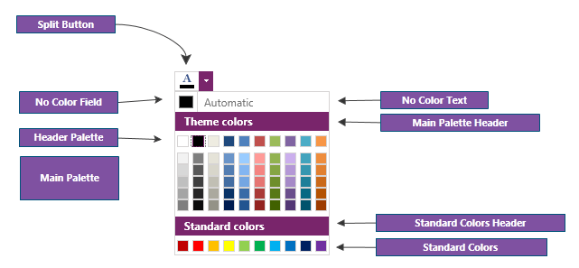
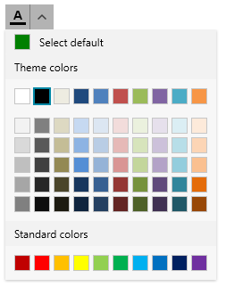
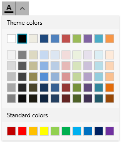

# Customizing Appearance

You can customize the appearance of the __ColorPicker__ component by using the available API.



## Customizing the Automatic Color 

The default automatic color is `Black`. To change this, set the `AutomaticColor` property of `RadColorPicker`.

To change the word "Automatic" shown in the button, set the `NoColorText` property of `RadColorPicker`.


```XAML
	 <telerik:RadColorPicker NoColorText="Select default" AutomaticColor="Green" />
```



To hide the automatic color button, set the `NoColorVisibility` property of `RadColorPicker`.


```XAML
	<telerik:RadColorPicker NoColorVisibility="Collapsed" />
```



## Customizing Palette Headers

To change the palette header text contents, set the `MainPaletteHeaderText`, `StandardPaletteHeaderText` and `RecentColorsHeaderText` properties of `RadColorPicker`.


```XAML
	<telerik:RadColorPicker MainPaletteHeaderText="Main Palette"
				StandardPaletteHeaderText="Standard Palette"
				RecentColorsHeaderText="Recent Colors"
				IsRecentColorsActive="true"/>
```


To hide the palettes, use the `StandardPaletteVisibility` and `HeaderPaletteVisibility` properties of `RadColorPicker`. The main palette cannot be hidden. The header palette is the first row with colors shown by default in the main palette.

## Customizing the Button

The button of the ColorPicker component is represented by `RadSplitButton`.

The default visualization of the button content is the letter __A__ with an underline matching the selected color. To replace this with custom content, use the `ContentTemplate` property of the `RadColorPicker`.


```XAML
    <telerik:RadColorPicker x:Name="colorPicker" SelectedColor="DeepSkyBlue" IsDropDownOpen="True">	
        <telerik:RadColorPicker.ContentTemplate>
            <DataTemplate>
                <TextBlock Text="Ab">
                    <TextBlock.Foreground>
                        <SolidColorBrush Color="{Binding ElementName=colorPicker, Path=SelectedColor}"/>
                    </TextBlock.Foreground>
                </TextBlock>			
            </DataTemplate>
        </telerik:RadColorPicker.ContentTemplate>
    </telerik:RadColorPicker>
```

__RadColorPicker with custom button content__


To change other properties of the button, use the `SplitButtonStyle` property of `RadColorPicker`.


```XAML
	<telerik:RadColorPicker.SplitButtonStyle>
		<Style TargetType="telerik:RadSplitButton">
			<Setter Property="Foreground" Value="Purple"/>
		</Style>
	</telerik:RadColorPicker.SplitButtonStyle>
```

## Customizing the Color Selector

The content in the drop down of the ColorPicker component is a `RadColorSelector` control. To change its appearance, set the `ColorSelectorStyle` property of `RadColorPicker`.


```XAML	
	<telerik:RadColorPicker.ColorSelectorStyle>
		<Style TargetType="telerik:RadColorSelector">
			<Setter Property="Background" Value="OliveDrab"/>
		</Style>
	</telerik:RadColorPicker.ColorSelectorStyle>
```
