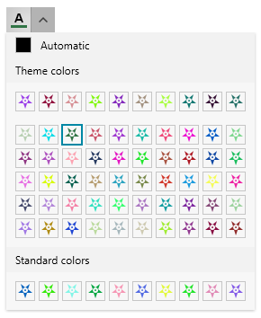

# Data Binding

The ColorPicker component allows data binding to properties of a business object. This article shows how to setup a view model and bind it to the `RadColorPicker` control.

To link the selected color to a property in the view model, bind the `SelectedColor` property of `RadColorPicker`.

To replace the default colors in the palettes, set the `HeaderPaletteItemsSource`, `MainPaletteItemsSource`, `PaletteItemsTemplate` and `StandardPaletteItemsSource` properties of `RadColorPicker`. You can assing collection of any type to these properties, and the customize the appearance of the generated containers using the `PaletteItemsTemplate` property of `RadColorPicker`. In case, the items source properties are assigned to a collection of `System.Windows.Media.Color` objects, you won't need to set the `PaletteItemsTemplate`.

The following example shows also how to replace the default color palette values, but this is not necessary. You can set only the `SelectedColor` property, if there is no need to change the default palettes.

#### __[C#] Defining the view model__
{{region radcolorpicker-data-binding-0}}
	public class MainViewModel : ViewModelBase
    {
        private static Random r = new Random(0);
        private Color selectedColor;

        public Color SelectedColor
        {
            get { return selectedColor; }
            set { selectedColor = value; OnPropertyChanged("SelectedColor"); }
        }

        public ObservableCollection<Color> MainPaletteColors { get; set; }
        public ObservableCollection<Color> HeaderPaletteColors { get; set; }
        public ObservableCollection<Color> StandardPaletteColors { get; set; }

        public MainViewModel()
        {
            MainPaletteColors = new ObservableCollection<Color>();
            for (int i = 0; i < 50; i++)
            {
                MainPaletteColors.Add(GetRandomColor());
            }

            HeaderPaletteColors = new ObservableCollection<Color>();
            for (int i = 0; i < 10; i++)
            {
                HeaderPaletteColors.Add(GetRandomColor());
            }

            StandardPaletteColors = new ObservableCollection<Color>();
            for (int i = 0; i < 10; i++)
            {
                StandardPaletteColors.Add(GetRandomColor());
            }

            this.SelectedColor = MainPaletteColors[10];
        }

        private static Color GetRandomColor()
        {
            return Color.FromRgb((byte)r.Next(1, 255), (byte)r.Next(1, 255), (byte)r.Next(1, 233));
        }
    }
{{endregion}}

#### __[C#] Setting up the data context__
{{region radcolorpicker-data-binding-1}}
	public MainWindow()
	{
		InitializeComponent();           
		DataContext = new MainViewModel();
	}
{{endregion}}

#### __[XAML] Data binding the properties__
{{region radcolorpicker-data-binding-2}}
	<telerik:RadColorPicker SelectedColor="{Binding SelectedColor, Mode=TwoWay}"							
							HeaderPaletteItemsSource="{Binding HeaderPaletteColors}" 
							MainPaletteItemsSource="{Binding MainPaletteColors}"                             
							StandardPaletteItemsSource="{Binding StandardPaletteColors}"/>
{{endregion}}

In case the palette items source collection are populate with custom objects (not of the `Color` type), the corresponding property that hold the color should be mapped with the `ColorPropertyPath` property of `RadColorPicker`.

#### __[XAML] Setting the ColorPropertyPath__
{{region radcolorpicker-data-binding-3}}
	<!-- this is required only if the palette items sources contain objects that are not of type System.Windows.Media.Color -->
	<telerik:RadColorPicker ColorPropertyPath="MyColorProperty"/>
{{endregion}}

## Using Custom Item Template

To replace the default rectangle appearance of the colors in the palette, set the `PaletteItemsTemplate` property of `RadColorPicker`.

#### __[XAML] Setting the PaletteItemsTemplate__
{{region radcolorpicker-data-binding-3}}
	<telerik:RadColorPicker SelectedColor="{Binding SelectedColor, Mode=TwoWay}"                         
							HeaderPaletteItemsSource="{Binding HeaderPaletteColors}" 
							MainPaletteItemsSource="{Binding MainPaletteColors}"                             
							StandardPaletteItemsSource="{Binding StandardPaletteColors}">
		<telerik:RadColorPicker.PaletteItemsTemplate>
			<DataTemplate>
				<Path Margin="2" 
					  Data="M8,6 C8.55,6 9,6.44 9,7 C9,7.55 8.55,8 8,8 
							C7.44,8 7,7.55 7,7 C7,6.44 7.44,6 8,6 z M3,0 
							L8,4 C6.34,4 5,5.34 5,7 C5,8.65 6.34,10 8,10 
							C9.65,10 11,8.65 11,7 C11,5.34 9.65,4 8,4 L13,0 
							L11,6 L16,10 L10,10 L8,16 L6,10 L0,10 L5,6 z ">
					<Path.Fill>
						<SolidColorBrush Color="{Binding}" />
					</Path.Fill>
				</Path>
			</DataTemplate>
		</telerik:RadColorPicker.PaletteItemsTemplate>
	</telerik:RadColorPicker>
{{endregion}}

## See Also  

* [Customize the PaletteViewItem's ToolTip]()
