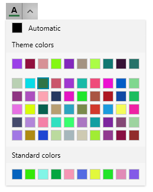
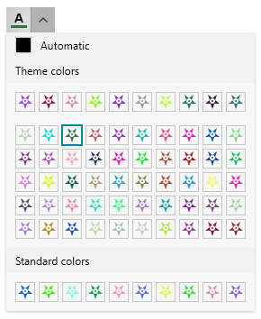

# Data Binding

The ColorPicker component allows data binding to properties of a business object. This article shows how to setup a view model and bind it to the `RadColorPicker` control.

To link the selected color to a property in the view model, bind the `SelectedColor` property of `RadColorPicker`.

To replace the default colors in the palettes, set the `HeaderPaletteItemsSource`, `MainPaletteItemsSource`, `PaletteItemsTemplate` and `StandardPaletteItemsSource` properties of `RadColorPicker`. You can assing collection of any type to these properties, and then customize the appearance of the generated containers using the `PaletteItemsTemplate` property of `RadColorPicker`. In case, the items source properties are assigned to a collection of `System.Windows.Media.Color` objects, you won't need to set the `PaletteItemsTemplate`.

The following example shows also how to replace the default color palette values, but this is not necessary. You can set only the `SelectedColor` property, if there is no need to change the default palettes.

__Defining the view model__
<snippet id='radcolorpicker-data-binding-defining_the_view_model-cs' />

__Setting up the data context__
<snippet id='radcolorpicker-data-binding-setting_up_the_data_context-cs' />

__Data binding the properties__
<snippet id='radcolorpicker-data-binding-data_binding_the_properties-xaml' />

In case the palette items source collection are populated with custom objects (not of the `Color` type), the corresponding property that holds the color should be mapped with the `ColorPropertyPath` property of `RadColorPicker`.

__Setting the ColorPropertyPath__
<snippet id='radcolorpicker-data-binding-setting_the_colorpropertypath-xaml' />

## Using Custom Item Template

To replace the default rectangle appearance of the colors in the palette, set the `PaletteItemsTemplate` property of `RadColorPicker`.

__Setting the PaletteItemsTemplate__
<snippet id='radcolorpicker-data-binding-setting_the_paletteitemstemplate-xaml' />

## See Also  

* [Customize the PaletteViewItem's ToolTip]()
